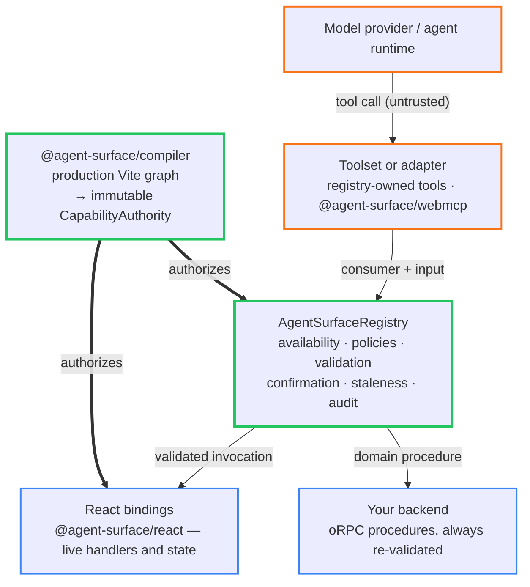
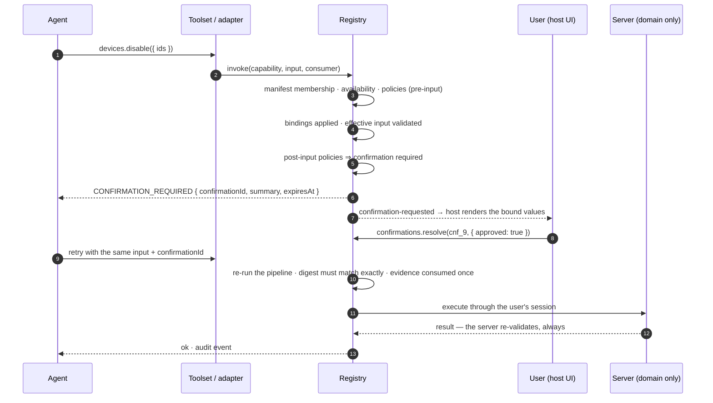

<div align="center">

# agent-surface

**Make agents first-class operators of your frontend — without handing them the DOM.**

[](https://github.com/Wiseair-srl/agent-surface/actions/workflows/ci.yml)
[](LICENSE)
[](package.json)
[](https://www.npmjs.com/package/@agent-surface/core)
[](https://agent-surface.dev)

[Getting started](https://agent-surface.dev/getting-started) · [Architecture](https://agent-surface.dev/02-architecture) · [Policies and security](https://agent-surface.dev/06-policies-and-security) · [CLI](https://agent-surface.dev/20-cli) · [Example](https://agent-surface.dev/10-examples) · [Limits](https://agent-surface.dev/11-non-goals)

</div>

Your UI, an embedded agent, a WebMCP client, and your test suite can all reach the same capabilities — typed, lifecycle-bound, policy-governed, and provably limited to what your production build declares.

> [!NOTE]
> **Published to npm** at **0.20.0** under `@agent-surface/*`: [`core`](https://www.npmjs.com/package/@agent-surface/core), [`compiler`](https://www.npmjs.com/package/@agent-surface/compiler), [`react`](https://www.npmjs.com/package/@agent-surface/react), [`orpc`](https://www.npmjs.com/package/@agent-surface/orpc), [`testing`](https://www.npmjs.com/package/@agent-surface/testing), [`webmcp`](https://www.npmjs.com/package/@agent-surface/webmcp), and [`cli`](https://www.npmjs.com/package/@agent-surface/cli). Documentation lives at **[agent-surface.dev](https://agent-surface.dev)**. Every push runs the suite across Node 20.19/22 × React 18.2/19, plus conformance, API closure, packed-artifact, `publint`, size, ESM and Vite smoke builds, and the example app's own contract drift gate. Pre-1.0, so a minor version may break.

```bash
pnpm add @agent-surface/core @agent-surface/react
pnpm add -D @agent-surface/compiler @agent-surface/cli
```

```bash
# or try it from a clean checkout
pnpm install && pnpm build && pnpm test
pnpm --filter devices-app-example dev                          # the example app
pnpm --filter devices-app-example exec agent-surface inspect   # its compiled contract
pnpm docs:dev                                                  # browse the documentation locally
```

## The idea

An agent should not operate your UI the way a scraper does. It invokes a **capability**: a statically declared, typed, semantic unit — an observation, an action, or a contextual reference to a backend procedure — that the compiler has proven your production code declares.

> Declare a capability once, in code. Expose only what the compiled contract authorizes.



Everything above the registry is untrusted. Everything below it is your application, unchanged. The compiler decides what may exist at all: runtime state narrows the surface — mounted, visible, available, callable — but it cannot invent capability identity, schemas, effects, confirmation posture, or policy attachments. Unknown, dynamic, stale, or semantically mismatched capabilities fail closed.

## Why

Agents drive frontends today through DOM scans, accessibility-tree dumps, CSS selectors, and screen coordinates. Three defects follow. Everything rendered is implicitly exposed, so a prompt-injected agent can click whatever the user can click. Nothing is semantic: "select the third row" is not "select device `dev_42`", and positional identity breaks on the next refactor. And nothing distinguishes "valid right now, in this view, for this user" from "present in the DOM".

The backend half of this problem is already solved. With oRPC and [orpc-agent](https://orpc-agent.dev), procedures are invisible to agents until exposing one is an explicit, typed, policy-governed act. agent-surface applies the same philosophy to the frontend, and keeps the two planes apart: domain operations stay on the server that re-validates them, while presentation capabilities exist only while their component is mounted. The library lets you *reference* a domain procedure; it structurally refuses to let you redefine one as a frontend tool.

## Quick start

Add the compiler to Vite, then declare static semantics and bind live behavior:

```ts
// vite.config.ts
import { agentSurface } from "@agent-surface/compiler";
import { defineConfig } from "vite";

export default defineConfig({ plugins: [agentSurface()] });
```

```tsx
import {
  actionContract,
  defineAgentComponentContract,
  emptyObjectSchema,
  fromJsonSchema,
  observationContract,
} from "@agent-surface/core";
import { useAgentComponent } from "@agent-surface/react";
import { useState } from "react";

// 1. Static, reviewable semantics — identity, schemas, effect, confirmation, policies
export const counterContract = defineAgentComponentContract({
  type: "demo.counter",
  description: "Counter",
  observations: {
    value: observationContract({
      description: "Current value",
      output: fromJsonSchema<number>({ type: "number" }),
    }),
  },
  actions: {
    increment: actionContract({
      description: "Increment once",
      input: emptyObjectSchema,
      effect: "local-state",
    }),
  },
});

export function Counter() {
  const [value, setValue] = useState(0);

  // 2. Live behavior — handlers, state, availability. Bound for exactly as long as this component is mounted
  useAgentComponent(counterContract, {
    observations: { value: { read: () => value } },
    actions: { increment: { execute: () => setValue((n) => n + 1) } },
  });

  return <button onClick={() => setValue((n) => n + 1)}>{value}</button>;
}
```

Create one registry at the application root, from the compiler's authority, and provide it to React:

```tsx
import authority from "virtual:agent-surface-contract";
import { createAgentSurfaceRegistry } from "@agent-surface/core";
import { AgentSurfaceProvider } from "@agent-surface/react";
import { createRoot } from "react-dom/client";

// 3. The registry requires the compiled authority — there is no unauthorized construction path
const registry = createAgentSurfaceRegistry({ authority });

createRoot(document.getElementById("root")!).render(
  <AgentSurfaceProvider registry={registry}>
    <App />
  </AgentSurfaceProvider>,
);
```

Then commit the reviewable contract and check it in CI:

```bash
pnpm exec agent-surface snapshot
git add .agent-surface/contract.json
pnpm exec agent-surface check --base origin/main --format github
```

Full walkthrough: [agent-surface.dev/getting-started](https://agent-surface.dev/getting-started).

## What happens on a call

Every invocation runs the same pipeline, in the same order, from every consumer. A destructive domain capability looks like this:



## What it gives you

- Capabilities are semantic and typed — observations, actions, and contextual procedure references — never selectors, coordinates, or synthetic clicks
- The resolved production graph is the only source of capability identity; a dynamic, unpinned, or non-serializable declaration fails the build instead of shipping an unproven surface
- Registration binds live behavior to a compiled contract, and the registry rejects anything the authority does not contain: unknown, stale, or semantically mismatched
- Policies filter per consumer at discovery and are re-evaluated at invocation, so a capability hidden from a consumer is denied to it, not merely missing from its catalog
- Dangerous effects demand single-use confirmation evidence bound to the exact input the user saw, with a TTL, and staleness beats approval
- Capabilities live exactly as long as their component: unmount tombstones the registration and late invocations fail with typed errors
- Registration, invocation, and confirmation all emit audit events; payloads travel only where a capability declares `audit: "full"`
- Tests exercise the whole surface deterministically — no LLM, no browser automation ([testing](https://agent-surface.dev/08-testing))

## Security model

The frontend is never a security boundary. What agent-surface does is make browser exposure explicit, minimal, and auditable:

- Nothing is exposed unless declared. There is no scanning code path, and descriptions confer no authority — the pipeline never branches on prose
- Authority is registration plus policies plus authenticated host context, decided by the runtime and never by the model's judgment
- **Authority hides, state discloses**: `hide` when the consumer lacks the right (existence is information you do not owe it), `disable` with a reason when state makes it momentarily invalid
- Confirmation evidence is bound to `{ registration, capability, consumer, effective input, effect }`, single-use, expiring, and never self-granted by the agent
- `explainSurface()` — the developer projection that discloses what `hide` withholds — is structurally unreachable from the package root that adapters import, enforced by a build check
- For domain operations, all of the above is UX layered on top of server enforcement, never instead of it

What it does not claim: isolation between scripts in the same realm (hostile page JavaScript can call the registry like any other code), durable exactly-once effects, forced cancellation of a non-cooperative handler, or any client-side protection of domain operations beyond UX. Read the [threat model](https://agent-surface.dev/06-policies-and-security#threat-model) and the [limits](https://agent-surface.dev/11-non-goals).

## Packages

| Package | Purpose |
|---|---|
| [`@agent-surface/core`](https://agent-surface.dev/03-core-api) | Contracts, authority, registry, policies, confirmation, invocation, exposure gateway |
| [`@agent-surface/compiler`](https://agent-surface.dev/02-architecture) | Vite production-graph compiler and canonical manifest |
| [`@agent-surface/react`](https://agent-surface.dev/04-react-api) | React provider and lifecycle-correct runtime bindings |
| [`@agent-surface/orpc`](https://agent-surface.dev/05-orpc-integration) | Contextual, authoritative domain procedure bindings |
| [`@agent-surface/testing`](https://agent-surface.dev/08-testing) | Deterministic harness, helpers, and matchers |
| [`@agent-surface/webmcp`](https://agent-surface.dev/09-adapters) | WebMCP transport adapter |
| [`@agent-surface/cli`](https://agent-surface.dev/20-cli) | Contract inspection, snapshots, integrity, and PR drift |

## Catching surface changes in review

Commit the compiled contract and let CI fail when the surface moves:

```bash
pnpm exec agent-surface snapshot   # writes .agent-surface/contract.json
pnpm exec agent-surface check      # exit 1 if the source no longer matches it
```

The snapshot carries no timestamps, checkout paths, or runtime ids, so identical source produces identical bytes — every diff is a real change, and `check` says what each one *means*:

```
AGENT SURFACE CHECK · FAIL

11 capabilities · 5 declarations · 6 action · 4 observation · 1 procedure
reach 9 low · 1 medium · 1 high · declared gates: 1 confirmation · 0 policy

Contract      08b424d2e3819333f39c612d64772df695404aa0373e962b44590ecf799d1620
Compiler      0.17.0
Completeness  proven
Targets       web-production
Snapshot      .agent-surface/contract.json
Integrity     stale

SOURCE ↔ SNAPSHOT (2) · widening 2 · narrowing 0 · neutral 0
~ widening  domain:devices.disable · src/agent/contracts.ts#devicesDisableContract · confirmation: required → optional
~ widening  domain:devices.disable · src/agent/contracts.ts#devicesDisableContract · effect: destructive → server-mutation
```

Both rows are deliberately counter-intuitive. Weakening a gate is widening, and so is *lowering* a declared effect: `destructive → server-mutation` describes less reach than the code has, and every review habit and policy keyed on the higher effect quietly stops applying. `inspect` shows the same inventory the gate reads, grouped by declaration:

```
REPOSITORY CONTRACT · 11 capabilities · 5 declarations

  CAPABILITY                     KIND         EFFECT       REACH   CONFIRM   POLICIES

src/agent/contracts.ts#devicesDisableContract (1)
  domain:devices.disable         procedure    destructive  high    required  —

src/agent/contracts.ts#devicesTableContract (3)
  view:devices.table.readState   observation  read         low     —         —
  view:devices.table.selectRows  action       local-state  low     —         —
  view:devices.table.sort        action       local-state  low     —         —
```

`REACH` grades the effect as a word rather than a colour, so a pipe and a CI log carry what the terminal does. And the view closes by saying what it cannot know: these are declarations compiled from the production graph — what the code can expose, not what a mount exposed at runtime. Whether a policy admits, denies, or hides a capability depends on the actor, input, and context of a real invocation, which no CLI command performs. Full rules, formats, and exit codes: [CLI](https://agent-surface.dev/20-cli).

## Example

[`examples/devices-app`](examples/devices-app) runs the whole architecture end to end: contracts declared in one file, the virtual manifest installed at the production composition root, React components binding live state, an oRPC bridge to the authoritative client, a committed `.agent-surface/contract.json`, and a scripted test covering filter → read → select → confirm → authoritative mutation → verify with no LLM in the loop. CI gates its contract on every push. Walkthrough: [agent-surface.dev/10-examples](https://agent-surface.dev/10-examples).

## Non-goals

No agent runtime, planner, or conversation state. No chat UI, router, data layer, or design system — the host renders confirmation dialogs. No DOM scanning, selector generation, or synthetic input. No RPC transport or server authorization system. No memory, workflow graph, or saga engine: one invocation executes one capability, and composition belongs to the agent loop or the backend. It does not replace oRPC or MCP either — WebMCP is one adapter, not the foundation. Full list: [limits and non-goals](https://agent-surface.dev/11-non-goals).

## Development

```bash
pnpm install
pnpm build
pnpm typecheck
pnpm test
pnpm check:conformance
pnpm check:api-closure
pnpm check:artifact
pnpm publint
pnpm size
pnpm docs:build
```

## Contributing

Design review, security analysis, and doc fixes are the most useful contributions. Start with [CONTRIBUTING.md](CONTRIBUTING.md), report security issues via [SECURITY.md](SECURITY.md), and follow the [Code of Conduct](CODE_OF_CONDUCT.md).

## License

MIT © Paolo Barbato / Wiseair.
