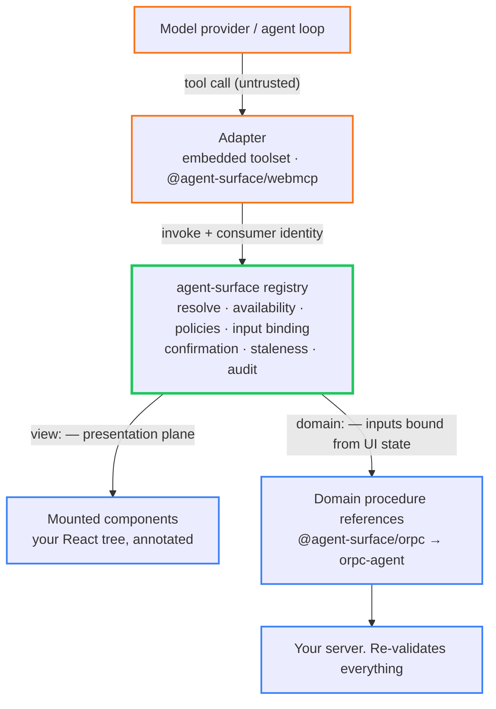
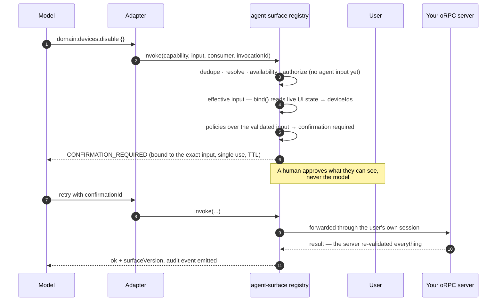

<div align="center">

# agent-surface

**Make agents first-class users of your frontend.**

[](https://github.com/Wiseair-srl/agent-surface/actions/workflows/ci.yml)
[](LICENSE)
[](package.json)
[](https://www.npmjs.com/package/@agent-surface/core)

[Vision](docs/00-vision.md) · [Concepts](docs/01-concepts.md) · [Core API](docs/03-core-api.md) · [Security model](docs/06-policies-and-security.md) · [Walkthrough](docs/10-examples.md) · [Roadmap](docs/project/12-roadmap.md)

**Documentation: https://agent-surface-docs.vercel.app**

</div>

Your components declare what an agent may observe and do while they are mounted — as typed, semantic capabilities under one set of policies, confirmations, staleness rules, and audit. Everything else on the page stays invisible to it.

> [!NOTE]
> **Published to npm** under `@agent-surface/*`: [`core`](https://www.npmjs.com/package/@agent-surface/core), [`react`](https://www.npmjs.com/package/@agent-surface/react), [`orpc`](https://www.npmjs.com/package/@agent-surface/orpc), [`testing`](https://www.npmjs.com/package/@agent-surface/testing), [`webmcp`](https://www.npmjs.com/package/@agent-surface/webmcp) and [`cli`](https://www.npmjs.com/package/@agent-surface/cli) — all six on one lockstep version, per the [release notes](.changeset/README.md). The specification in [`docs/`](docs) was written first and is normative; the packages implement it. CI runs the full suite on Node 20.19/22 × React 18.2/19 with no LLM anywhere, and gates the traceability manifest: every requirement in [`spec/conformance.json`](spec/conformance.json) must be `implemented` and cite a test that names it, or the build fails. Usable, and explicitly not yet *Stable* — see the [graduation criteria](docs/project/12-roadmap.md#stability-policy). The name `agent-surface` is provisional.

```bash
pnpm add @agent-surface/core @agent-surface/react
```

```bash
# or try it from a clean checkout
pnpm install && pnpm build && pnpm test
pnpm --filter devices-app-example dev   # the documented page, driven by a scripted agent
pnpm docs:dev                           # browse the documentation site locally
```

## The idea

An agent must not touch your UI. It requests a **capability**: a semantic operation a mounted component has explicitly declared, with a JSON-Schema contract, an availability rule, and governance attached.

> If a component or capability is not explicitly annotated, it does not exist for the agent.



The surface at any moment is a function of application state:

```text
agent surface = mounted components + current route + current state + policies
```

## Why

Agents that operate web applications today do it the wrong way around: they scan the DOM, guess at CSS selectors, click coordinates, or interpret screenshots. That is fragile (markup changes break it), unsafe (everything interactive is implicitly exposed), and semantically poor — the agent sees `<button class="btn-4">`, not "disable the selected devices".

The backend already has a clean answer. With [oRPC](https://orpc.unnoq.com) and [orpc-agent](https://orpc-agent.dev), a procedure is invisible to agents unless explicitly exposed; when exposed it becomes a typed tool with contracts, auth, policies, approvals, and audit attached. The frontend has no equivalent. agent-surface is that equivalent, and it deliberately does **not** model `click`, `type`, or `focus`. It models what the user means: select rows, set a filter, open a drawer, focus a device on the map.

## Quick start

```tsx
import { createAgentSurfaceRegistry, action, observation } from "@agent-surface/core";
import { AgentSurfaceProvider, useAgentComponent } from "@agent-surface/react";
import { createOrpcAgentBridge } from "@agent-surface/orpc";
import { useAgentProcedure } from "@agent-surface/orpc/react";

// One registry per app, wrapped in <AgentSurfaceProvider registry={registry}>.
const registry = createAgentSurfaceRegistry({ environment: "production" });
// Domain procedures the backend already exposes through orpc-agent — the ceiling.
const bridge = createOrpcAgentBridge({ client: orpcClient, manifest: agentManifest });
registry.setProcedureExecutor(bridge.executor);

function DevicesTable() {
  const [selectedIds, setSelectedIds] = useState<string[]>([]);
  const visibleRows = useDevices(); // normal app data fetching

  // Presentation plane: what this view can show and change, while it is mounted.
  useAgentComponent({
    type: "devices.table",
    description: "Table of devices matching the active filters",
    observations: {
      readState: observation({
        description: "Visible rows and the current selection",
        output: TableStateSchema,
        read: () => ({ visibleRows, selectedIds }),
      }),
    },
    actions: {
      selectRows: action({
        description: "Replace, extend or reduce the row selection",
        input: SelectRowsSchema,
        effect: "local-state",
        execute: ({ ids }) => setSelectedIds(ids),
      }),
    },
  });

  // Domain plane: reference an existing oRPC procedure — never redefine it.
  useAgentProcedure(bridge.refs.devices.disable, {
    when: () => selectedIds.length > 0,
    unavailableReason: "Select at least one device first",
    bind: () => ({ deviceIds: selectedIds }), // locked: the agent cannot override it
    confirmation: "required",
  });

  return <Table /* normal rendering */ />;
}
```

Hand the registry to any agent loop that accepts JSON-Schema tools:

```ts
import { createAgentToolset } from "@agent-surface/core";

const toolset = createAgentToolset(registry, {
  consumer: { id: "copilot", kind: "embedded" },
  topology: "embedded", // required (D26): embedded → confirmations "wait"; remote → "two-phase"
});
```

While the component is mounted the agent sees `view:devices.table.readState`, `view:devices.table.selectRows`, and — only once something is selected — `domain:devices.disable`. On unmount they are gone, and a late invocation fails with a typed `COMPONENT_UNMOUNTED`. Nothing else on the page is visible. Full walkthrough: [docs/10-examples.md](docs/10-examples.md).

## What happens on a call

Every `invoke` runs the same [10 phases in the same order](docs/02-architecture.md#invocation-pipeline-normative-order). A destructive domain operation with UI-bound input looks like this:



The validated effective input exists *before* any input-aware policy or confirmation decision runs, so a confirmation can only ever bind to an input that has been fully constructed and validated (D21). Availability and policies are re-evaluated at invocation time, never trusted from discovery time.

## Two planes, never blurred

|  | Domain plane | Presentation plane |
|---|---|---|
| Meaning | Operations valid even with no UI open | Capabilities of the currently mounted view |
| Examples | disable device, generate report, invite user | set filter, select rows, open drawer, navigate |
| Owner | Backend, via oRPC + `orpc-agent` | Frontend, via agent-surface |
| ID prefix | `domain:` | `view:` |
| Authority | Server re-validates everything | Client runtime, advisory only |

agent-surface never duplicates a domain procedure as a frontend tool. It can only *reference* one — making it contextually visible, binding inputs from live UI state, adding frontend confirmation UX — while the backend remains the sole authority. Bound fields are removed from the agent-facing schema and locked; the merged input is re-validated against the full original schema before forwarding. See [docs/05-orpc-integration.md](docs/05-orpc-integration.md).

## What it gives you

- Capabilities are **semantic**, not DOM: no selectors, no coordinates, no screenshots, no scanning code path
- **Lifecycle-aware** registration: mount registers, unmount removes, and stale invocations are rejected with typed errors rather than acting on a vanished view
- Typed in and out via **Standard Schema** (Zod, Valibot, …) plus a built-in JSON Schema subset validator
- **Composable policies** at discovery *and* invocation, with a hide-vs-disable rule that is part of the security model
- **Single-use confirmation evidence**, bound to the exact inputs the user saw, with a TTL
- **Provider-neutral toolset** — Vercel AI SDK, Mastra, LangGraph, assistant-ui all consume it directly; there is deliberately no per-framework package
- Deterministic ordering: total order of surface mutations, serialized actions per instance, bounded observation concurrency, at-most-once execution per invocation key
- **No LLM required to test any of it**

## Security model

The frontend is never a security boundary. agent-surface makes the client honest, minimal, and auditable, and leaves authority to the server. [Twelve deny-by-default requirements](docs/06-policies-and-security.md#the-deny-by-default-requirements-mapped) hold the design together:

- Nothing is exposed without an explicit `register()`. There is no scanning path and no "expose everything" switch
- Descriptions confer no authority; the pipeline never branches on them. Authority is registration + policies + authenticated context
- A capability hidden from a consumer at discovery is equally denied to it at invocation, and is indistinguishable from one that does not exist
- Confirmation evidence is bound to (registration, capability, input), single-use, and expiring — it cannot be replayed or bait-and-switched
- Identity is code-authored and stable, independent of text, position, or CSS

What this does not claim: **isolation between scripts in the same realm** (hostile JS in your page can call the registry like any other code), any client-side protection of domain operations beyond UX, exactly-once execution beyond a bounded dedupe window, or forced cancellation of a non-cooperative handler. The [known limitations](docs/11-non-goals.md#known-limitations-honest-normative--directive-94) are written down so nobody discovers them in production. Read the [threat model](docs/06-policies-and-security.md#threat-model) before shipping.

## Packages

| Package | Purpose |
|---|---|
| [`@agent-surface/core`](packages/core) | Registry, identity, schemas, snapshot, invocation pipeline, policies, confirmation, audit, toolset projection. Zero runtime dependencies |
| [`@agent-surface/react`](packages/react) | Lifecycle-correct hooks — no dependency arrays, no stale closures, Strict Mode and SSR safe |
| [`@agent-surface/orpc`](packages/orpc) | Contextual references to oRPC procedures exposed via `orpc-agent`, with UI-state binding |
| [`@agent-surface/testing`](packages/testing) | Render / discover / invoke / assert, plus surface snapshots. No LLM |
| [`@agent-surface/webmcp`](packages/webmcp) | WebMCP (`navigator.modelContext`) transport adapter — **Experimental** |
| [`@agent-surface/cli`](packages/cli) | `init` / `inspect` / `snapshot` / `check` — the live surface in a terminal, drift as a CI gate, and what no scenario reaches |

Boundaries and data flow: [docs/02-architecture.md](docs/02-architecture.md). Every package ships ESM + `.d.ts`, `sideEffects: false`, and a size budget enforced in CI.

## Reviewing what agents can see

The agent surface is a contract, so it is reviewed like one: commit it, and let CI fail when it moves.

```tsx
const s = await renderAgentSurface(<DevicesPage />);

expect(s).toExpose("view:devices.table.selectRows");
expect(s).toExposeUnavailable("domain:devices.disable", {
  reason: "Select at least one device first",
});
expect(s).toMatchSurfaceSnapshot(); // the reviewable "what agents can see" artifact
```

Snapshots normalize volatility (`registrationId` → `<reg#N>`), so they survive Strict Mode and remounts and every diff is a real change in reach. The matchers distinguish *hidden* from *visible-disabled* on purpose — that distinction is the security model, not a UX detail: a hidden capability must be indistinguishable from a nonexistent one, while a disabled one tells the agent why it cannot run it yet. Recipes: [docs/08-testing.md](docs/08-testing.md).

The CLI answers the same question without a test file, and two more a snapshot cannot:

```bash
agent-surface inspect                      # what an agent can reach, and what it cannot
agent-surface inspect anonymous --explain  # why is my capability missing?
agent-surface check                        # non-zero on drift, or on a capability no scenario reaches
```

```text
scenario anonymous  route /devices
0 callable, 0 visible-disabled, 11 hidden

hidden by policy (absent from the snapshot)  (11)
  - set  [devices.filters@default]
      Update one or both filters; omitted fields are unchanged.
      policy authenticated (registry, discovery/authorize): hide
```

Hiding is what the security model is *for*, so a snapshot cannot tell you a capability was hidden, let alone by which policy. `--explain` is the developer-side answer, and it is deliberately unreachable from the package root an adapter imports.

The other gap is a route no scenario visits: it never registers, so it appears in no snapshot and drifts against no baseline — invisible to a mount by construction. So every command reads the authored catalog straight from the TypeScript program (no server, no jsdom, no mount) and subtracts what the scenarios actually reached:

```text
UNREACHED — authored, and no scenario mounts it  (1)
CAPABILITY                ORIGIN
view:billing.invoices.export  src/billing/Export.tsx:26

12 authored · 11 reached · 1 unreached · 2 scenarios (admin, anonymous)
```

`inspect` reports that and `snapshot` reports it; **`check` fails on it**. `--depth static|runtime|full` picks which halves to compute. [docs/20-cli.md](docs/20-cli.md).

## Example

**Devices app** — the spec's acceptance artifact, not a toy. The full [docs/10](docs/10-examples.md) page: a filterable table, a details drawer, navigation, a confirmation host, and a `domain:devices.disable` reference bound to the live selection. Two drivers share one embedded toolset — a scripted fake model that runs in CI, and an optional real model via OpenRouter — with a step mode for watching the surface change under the agent between calls. Its committed surface snapshot is the acceptance test. Run it with `pnpm --filter devices-app-example dev`.

For a server-side loop, [docs/16-mastra-assistant-ui.md](docs/16-mastra-assistant-ui.md) sketches the Mastra + assistant-ui + orpc-agent topology — hand-written snippets, explicitly not a package.

## Non-goals

No agent loop, planner, prompts, or memory. No chat UI, no generative UI, no workflow engine. No new RPC framework and no replacement for oRPC — domain operations stay procedures. No browser automation: no DOM scanning, selectors, synthetic input, or screenshots, since that model is the problem statement rather than the roadmap. No wire protocol competing with MCP or WebMCP, and no enterprise authorization framework. Full list with rationale: [docs/11-non-goals.md](docs/11-non-goals.md).

## Roadmap

Shipped so far, one theme per minor:

| | Theme |
|---|---|
| **v0.1** | All five packages, the example app, the conformance manifest, the P0 protocol corrections (D21–D26) |
| **v0.2** | *Trust, not surface area* — meta-tools parity with direct mode, D25 concurrency groups, a real support matrix |
| **v0.3** | *Catalog scale* (D28–D30) — capability state as structured data, so a provider's cached prompt prefix survives a click |
| **v0.4** | *Discovery honesty* (D31) — `surface_discover` marks a scope its floor refused, so an empty payload no longer reads as an empty surface |
| **v0.5** | *The split is the only composition* — the D28 compatibility flags removed outright rather than flipped |
| **v0.6** | *Meta-mode reliability* (D32) — `surface_act` validates its own envelope and types its `input` |
| **v0.7** | *`meta` is Experimental again* (D29 reversed) — two envelope defects in one minor is not what a supported label absorbs |
| **v0.8** | *The surface is inspectable* — `@agent-surface/cli` and `explainSurface()`, which names the policy behind a hidden capability |
| **v0.9** | *The CLI meets an application that is not this one* (D34) — the first defects found by hosting a real app rather than the example |
| **v0.10** | *Surface coverage* (D35–D37) — the authored catalog is read without mounting anything, and what no scenario reaches is reported |
| **v0.11** | *One command per question* (D38) — five commands became `init`/`inspect`/`snapshot`/`check` behind a `--depth` dial, and `check` now fails on a capability no scenario reaches instead of naming it as another command's problem |

**Next — adoption and enforcement.** API compatibility reports, benchmark thresholds in CI, the `orpc-agent` manifest decision, a presentation-only starter example, and a second adoption context, which is the real blocker on graduating anything to Stable. **Later:** MCP bridge, cross-tab and multi-window surfaces, iframe/worker isolation for third-party registrants, frameworks beyond React.

Details, decision log, and open questions: [docs/project/12-roadmap.md](docs/project/12-roadmap.md) and [docs/project/13-open-questions.md](docs/project/13-open-questions.md).

## Documentation

| Doc | Content |
|---|---|
| [Vision](docs/00-vision.md) | Why this exists, design principles |
| [Concepts](docs/01-concepts.md) | Planes, capabilities, identity, effects, availability |
| [Architecture](docs/02-architecture.md) | Packages, boundaries, data flow, runtime guarantees |
| [Core API](docs/03-core-api.md) | `@agent-surface/core` normative API |
| [React API](docs/04-react-api.md) | `@agent-surface/react` normative API |
| [oRPC integration](docs/05-orpc-integration.md) | Domain procedure references and binding |
| [Policies & Security](docs/06-policies-and-security.md) | Policy pipeline, confirmation, threat model |
| [Errors](docs/07-errors.md) | Typed error model |
| [Testing](docs/08-testing.md) | `@agent-surface/testing` and test recipes |
| [Adapters](docs/09-adapters.md) | Adapter contract, embedded toolset, WebMCP, MCP bridge |
| [Examples](docs/10-examples.md) | End-to-end devices page walkthrough |
| [Non-Goals](docs/11-non-goals.md) | What this library refuses to be, and its known limits |
| [Roadmap](docs/project/12-roadmap.md) | Versions and graduation criteria |
| [Decisions](docs/project/13-open-questions.md) | Decision log + genuinely open questions |
| [Implementation plan](docs/project/14-implementation-plan.md) | Milestones for implementing this spec |
| [Completeness review](docs/project/15-completeness-review.md) | Self-review of this specification |
| [Mastra + assistant-ui](docs/16-mastra-assistant-ui.md) | Wiring a Mastra loop + assistant-ui + orpc-agent (guide, not executable) |
| [Maintainer directive](docs/project/17-maintainer-directive.md) | Standing execution directive: phase gates, PR procedure |
| [Spec Corrections RFC](docs/project/18-spec-corrections-rfc.md) | Accepted RFC closing the P0 protocol bugs (D21–D26) |
| [Catalog Scale RFC](docs/project/19-catalog-scale-rfc.md) | Accepted RFC on catalog scale (D28–D30) |
| [CLI](docs/20-cli.md) | `@agent-surface/cli` normative command contract |
| [Surface Coverage RFC](docs/project/21-surface-coverage-rfc.md) | Accepted RFC on surface coverage (D35–D37) |

## Contributing

Security analysis, review of the as-built code against the documented invariants, and adoption feedback from a real application are the most useful contributions right now. Start with [CONTRIBUTING.md](CONTRIBUTING.md), report vulnerabilities via [SECURITY.md](SECURITY.md) (never a public issue), and follow the [Code of Conduct](CODE_OF_CONDUCT.md). The standing execution contract for maintainers is [docs/project/17-maintainer-directive.md](docs/project/17-maintainer-directive.md). Releases go through [Changesets](.changeset/README.md): `pnpm changeset` → release PR → npm publish from CI.

```bash
pnpm install
pnpm build       # tsup builds for all packages
pnpm test        # vitest, no LLM anywhere
pnpm typecheck
pnpm check:conformance
```

## License and independence

MIT © Wiseair S.r.l. agent-surface is an independent project, not affiliated with or endorsed by the oRPC project. It builds on oRPC and `orpc-agent` and stays strictly on its own side of the boundary: the server remains the authority.
