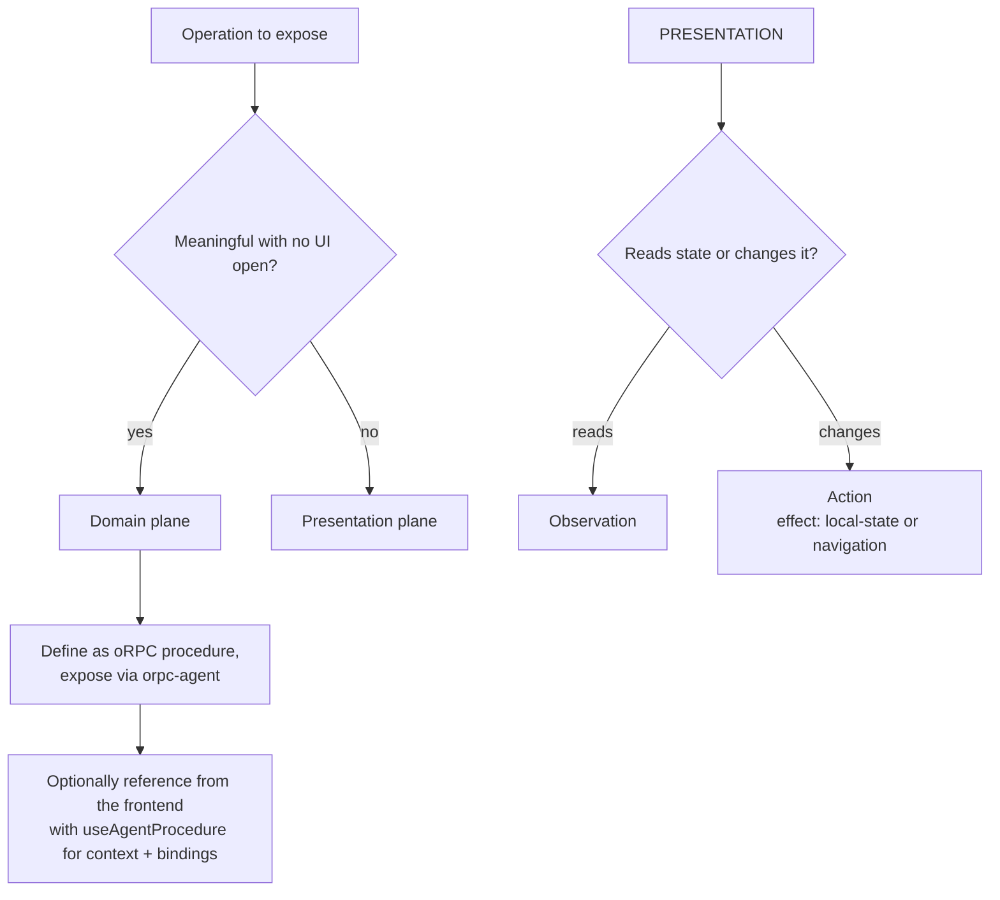

# Concepts

> A capability exists only through the compiler-generated production contract and its runtime authority. Static declarations own identity and governance metadata; runtime bindings own handlers, state, and availability. Raw definitions are inert: no public execution boundary accepts them.

> [!NOTE]
> This page defines the conceptual model and terminology used throughout the library.

> [!TIP]
> **The whole model in five sentences.** A component that wants to be agent-controllable registers *capabilities*: reads (**observations**), view changes (**actions**), or references to existing backend operations (**procedure references**) — everything else on the page is invisible to agents. Capabilities exist only while their component is mounted, are typed with JSON Schemas, and are addressed by stable, code-authored ids. Backend operations are never redefined in the frontend; they are only made contextually available, with inputs bound from UI state. Every invocation re-checks availability and policy at execution time, and anything dangerous requires single-use user confirmation. The server re-validates domain operations regardless of anything the frontend did.

## Normative language and stability labels

- **MUST / MUST NOT / SHOULD / SHOULD NOT / MAY** are used as in RFC 2119.
- Unlabeled behavior describes the current supported contract.
- **Experimental** behavior is opt-in and may change incompatibly.

## The two planes

Every operation an agent can perform through an application belongs to exactly one plane.

### Domain plane (`domain:`)

Operations that have meaning independently of any mounted UI: fetch devices, rename a device, disable a device, generate a report, invite a user, export data, update persistent configuration.

- They live in the **backend**, defined as oRPC procedures and exposed to agents via `orpc-agent`.
- agent-surface **MUST NOT** define, reimplement, or duplicate them. It MAY *reference* them (see [oRPC integration](05-orpc-integration.md)) to make them contextually available and to bind inputs from UI state.
- The server is the sole authority: it re-validates authentication, authorization, input, and policy on every call, regardless of anything the frontend did.

### Presentation plane (`view:`)

Capabilities bound to the currently mounted view and its local state: navigate to a route, open/close a drawer, switch tab, change a view filter, select table rows, sort, show/hide columns, expand a chart, focus a map marker, read the visible state of a component.

- They live in the **frontend**, registered by components through agent-surface.
- They exist only while the owning component is mounted and enabled.
- Their authority is the client runtime's policy pipeline — advisory by design, since the client is not a trusted boundary. They therefore MUST NOT be the only gate in front of anything irreversible or server-authoritative.

### The litmus test

> Does this operation make sense even when no user interface is open?

Yes → domain plane. No → presentation plane.



One consequence trips people up: *changing a filter that causes the app to re-query the server is still a presentation action.* The fetch is a reactive consequence mediated by the app's normal data layer — identical to what happens when the user clicks the same filter. The action's direct effect is local view state. Direct server effects are reserved for domain procedure references.

## Capability

A **capability** is the unit of agent-visible functionality. There are exactly three kinds:

| Kind | Plane | Direction | Declared effect |
|---|---|---|---|
| **Observation** | view | read | `read` (implicit) |
| **Action** | view | write | `local-state` \| `navigation` |
| **Procedure reference** | domain | write (or read) | `server-query` \| `server-mutation` \| `external-side-effect` \| `destructive` |

### Observations

Read the semantic state of a component: visible rows, selected rows, active filters, current sorting, active tab, current route, open drawer, visible time range, items shown on a map.

Observations:

- MUST NOT produce side effects (normative contract on the author; the runtime cannot verify it, but the testing package helps enforce it — see [Testing](08-testing.md));
- MUST have a typed output schema;
- MAY be subject to policies (including hiding them from unauthorized consumers);
- SHOULD return semantic, minimal data — never a dump of internal component state, never more than the consumer is authorized to see;
- are executed **on demand** through invocation; snapshots contain descriptors, never observation output.

### Actions

Change presentation state. Every action declares: canonical name, description, input schema, optional output schema, handler, effect category, idempotence, reversibility, policies, confirmation requirement, and optional preconditions. Full definition shape in [Core API](03-core-api.md).

### Procedure references

A declaration that an *existing* domain procedure is relevant in the current view, optionally with UI-derived input bindings and extra frontend policy (typically confirmation UX). A procedure reference is **not a second tool**: its identity is the procedure's canonical identity, and execution flows through the normal oRPC client to the authoritative server procedure. Full model in [oRPC integration](05-orpc-integration.md).

## The identity ladder

agent-surface distinguishes five identity levels. Confusing them is the root cause of most agent-UI bugs, so the distinction is normative.

```text
component type   devices.table            what kind of surface unit this is
instance         devices.table @ main     one mounted occurrence of that type
registration     reg_01H8...              one mount lifetime of that instance
capability       view:devices.table.selectRows   one operation of that type
entity           device_456               a domain object referenced in inputs/outputs
```

- **Component type** — a stable, code-reviewed identifier for a kind of agent component (`devices.table`). Part of the public surface contract.
- **Instance ID** — distinguishes simultaneous mounts of the same type (`main`, `comparison`, or an entity id for per-row components). Chosen by the application from *data*, never from DOM order or render index. Defaults to `"default"`.
- **Registration ID** — an opaque, runtime-generated identifier for one mount lifetime. It changes on every remount and is the precise handle for staleness detection. Never stable, never authored.
- **Capability ID** — the canonical name of one operation: `plane:componentType.capabilityName`.
- **Entity ID** — application-domain identifiers (`device_456`) that flow *through* inputs and outputs. The library treats them as opaque payload; authorizing them is the server's job.

### Canonical ID grammar

```text
capability-id   = plane ":" component-type "." capability-name
plane           = "view" | "domain"
component-type  = segment *( "." segment )
segment         = lowercase-letter *( lowercase-letter / digit / "-" )
capability-name = lowercase-letter *( letter / digit )        ; camelCase, no dots
instance-id     = 1*( letter / digit / "-" / "_" )            ; app-chosen, data-derived
```

- Parsing is unambiguous: the capability name is everything after the **last** dot; segments never contain uppercase, capability names never contain dots. Underscores are reserved (they are used by the wire-name encoding, [Adapters](09-adapters.md#wire-names)).
- For `domain:` IDs, the part after the prefix is the canonical oRPC procedure path (e.g. `devices.disable`) and is treated as opaque — agent-surface does not parse it further.
- Maximum ID length: 128 characters. Registration MUST reject IDs violating the grammar (`INVALID_DEFINITION`, see [Errors](07-errors.md)).
- Identity MUST NOT be derived from visible text, screen position, CSS selectors, or DOM structure.

Examples:

```text
view:devices.table.selectRows
view:devices.filters.setStatus
view:app.navigation.goTo
domain:devices.disable
```

### No cross-plane duplication

`domain:devices.disable` and `view:devices.disable` MUST NOT both exist. A frontend capability may *prepare, contextualize, or present* a domain operation, never redefine it. The registry detects suspicious suffix collisions between registered view capabilities and known domain procedure paths and warns, or rejects them when configured to do so. See [Core API](03-core-api.md#collisions).

## Effect taxonomy

```ts
type AgentEffect =
  | "read"                 // observations only (implicit)
  | "local-state"          // view actions: mutate local/view state
  | "navigation"           // view actions: change route or top-level view
  | "server-query"         // procedure references only
  | "server-mutation"      // procedure references only
  | "external-side-effect" // procedure references only (email, webhook, ...)
  | "destructive";         // procedure references only (hard to undo)
```

`server-query`, `server-mutation`, `external-side-effect`, and `destructive` are **reserved for procedure references**. View actions MUST declare `local-state` or `navigation`; registering a view action with a server effect fails with `PLANE_VIOLATION`. Model a destructive local action, such as clearing an unsaved draft, as `local-state` with `reversible: false` and `confirmation: "required"`.

**Navigation completion.** A `navigation` action's success is defined by its **handler settlement**, never by its owner's unmount timing. The handler resolves when the host router accepts or commits the transition. A successful navigation that unmounts its registering component still reports `ok`. See [Core API §concurrency](03-core-api.md#concurrency-timeouts-cancellation).

### Orthogonal properties and defaults

Every capability additionally declares:

```ts
{
  idempotent: boolean;                          // same input twice ⇒ same end state, no extra effect
  reversible: boolean;                          // the user can trivially undo it in the UI
  confirmation: "never" | "optional" | "required";
  audit: "none" | "metadata" | "full";
}
```

Defaults by kind/effect (applied when the author omits the property):

| Kind / effect | idempotent | reversible | confirmation | audit |
|---|---|---|---|---|
| Observation (`read`) | `true` (forced) | — | `"never"` | `"none"` |
| Action `local-state` | `false` | `true` | `"never"` | `"metadata"` |
| Action `navigation` | `false` | `true` | `"never"` | `"metadata"` |
| Procedure `server-query` | `true` | — | `"never"` | `"metadata"` |
| Procedure `server-mutation` | `false` | `false` | `"optional"` | `"metadata"` |
| Procedure `external-side-effect` | `false` | `false` | `"required"` | `"full"` |
| Procedure `destructive` | `false` | `false` | `"required"` (cannot be lowered below `"optional"`) | `"full"` |

`confirmation: "optional"` means: not required by the capability itself, but a policy or the consumer's configuration MAY escalate it to required. The runtime — never the model — has final authority on whether an invocation proceeds.

### Layer/target/effect metadata

Descriptors expose `plane` and `effect`; adapters SHOULD render them into human/model-readable prefixes so the model can distinguish, at a glance:

- a **query used for its own reasoning** → `plane: "domain"` or observation, effect `read`/`server-query`;
- an **action changing what the user sees** → `plane: "view"`, effect `local-state`/`navigation`;
- a **mutation of authoritative application state** → `plane: "domain"`, effect `server-mutation`/`destructive`.

## Availability, visibility, and the deny-by-default rule

A capability, at any instant, is in exactly one of three states *for a given consumer*:

| State | In snapshot? | Invocable? | Produced by |
|---|---|---|---|
| **available** | yes | yes | mounted + `enabled` + `when()` true + no policy objection |
| **unavailable** (visible-disabled) | yes, with `available: false` and `unavailableReason` | no → `CAPABILITY_NOT_AVAILABLE` | `when()` false, `enabled: false`, or a policy returning *disable* |
| **hidden** | no | no → `CAPABILITY_NOT_FOUND` | not registered, unmounted, or a policy returning *hide* |

**Normative rule:** *authority hides, state discloses.*

- Lack of **authorization** (the consumer/user may never do this) → **hidden**. Existence of a capability is itself information; deny-by-default means not leaking it.
- Invalid **state** (the user could do this, but not right now: no rows selected, drawer already open) → **visible-disabled with a reason**. This is deliberately disclosed because it lets the agent plan ("select rows first, then `domain:devices.disable` becomes available").

Built-in policies follow this rule; custom policies choose explicitly (`hide` vs `disable` decisions, [Policies & Security](06-policies-and-security.md)).

**Mounted ≠ visible.** Unmounting always removes capabilities, but some UI patterns keep components mounted while hidden (inactive tabs, off-screen virtualized content, `Activity`/keep-alive). Such components MUST gate themselves with `enabled: false` (or `when`) while not presented to the user. The React adapter documents the pattern ([React API](04-react-api.md#visibility)).

## Surface, snapshot, and version

- The **surface** is the live set of registrations plus their availability, as filtered by policies for a given consumer.
- A **snapshot** is an immutable, serializable capture of the surface at one instant: a catalog of components and capability *descriptors* (schemas, descriptions, availability, binding metadata) — never handlers, never eagerly-read state.
- `surfaceId` is a random identifier minted per registry instance. `surfaceVersion` is a monotonically increasing integer, serialized as a string and scoped to that `surfaceId`. It increments on every surface-affecting mutation. Together they order and scope snapshots; see [Core API](03-core-api.md#versioning).
- **Staleness**: an invocation may carry the `registrationId` (and optionally `surfaceVersion`) it discovered. If the target registration has since been replaced, the invocation fails with `STALE_CAPABILITY`; if it is gone, with `COMPONENT_UNMOUNTED`. The registry never keeps executable references to unmounted components.

### The lazy interaction model

To avoid shipping application state into the model's context, consumers follow four steps, each explicit and policy-checked:

1. **discover components** — snapshot, catalog only;
2. **discover capabilities** — descriptors with schemas and availability;
3. **invoke targeted observations** — read exactly the state needed;
4. **execute actions / procedures** — with staleness, policy, and confirmation enforcement.

## Consumers

A **consumer** is the identified agent-side client of a surface: the embedded copilot, a WebMCP peer, a test harness. Consumers carry an id, a kind, and optional grants; snapshots and invocations are evaluated *per consumer*. An agent MUST NOT be able to invoke a capability that was not present in the surface granted to it — enforced because invocation re-runs the same policy pipeline that filtered the snapshot ([Policies & Security](06-policies-and-security.md)).

## Policies

Composable middleware attached at registry, component, or capability level, evaluated **both** at discovery (synchronously, to filter/disable) and at invocation (asynchronously, authoritatively for the client side). Discovery-time evaluation is an optimization and a UX aid; invocation-time evaluation is the client-side gate; the server remains the real gate for domain operations. Full model in [Policies & Security](06-policies-and-security.md).

## Confirmation

A confirmation dialog is a *representation* of policy, not the policy. The runtime returns a typed `CONFIRMATION_REQUIRED` outcome with a single-use, expiring confirmation record bound to a canonical digest of the exact request: surface, registration, capability, consumer, **validated effective input**, and effect. The host renders UI; the user resolves it; the agent or adapter retries with the confirmation evidence. A domain server MAY also require its own approval. See [Policies and security](06-policies-and-security.md#confirmation).

## Trust of registrants

Registrations are code running in the page, but not all page code is equally trusted (third-party widgets, embedded iframes with access to the app bundle, plugins). Each registration carries an `origin` label (default `"first-party"`); the registry can be configured with a registration guard that rejects or restricts registrations from other origins. This distinguishes first-party capabilities from capabilities registered by less-trusted code without pretending the browser gives real isolation — see the honest limits in [Policies & Security](06-policies-and-security.md#trust-model-for-registrants).

## Glossary (quick reference)

| Term | Meaning |
|---|---|
| agent surface | The set of capabilities currently exposed to a consumer |
| agent component | A registration unit grouping capabilities under a component type + instance |
| capability | Observation, action, or procedure reference |
| plane | `domain` (backend-authoritative) or `view` (presentation) |
| descriptor | The serializable, agent-visible description of a component/capability |
| snapshot | Immutable capture of the surface catalog for a consumer |
| registry | The core runtime holding registrations and dispatching invocations |
| consumer | An identified agent-side client of the surface |
| adapter | Bridge between the registry and a consumer/transport |
| policy | Middleware deciding visibility and invocability |
| binding | UI-derived values pre-filling (and usually locking) procedure inputs |
| confirmation evidence | Single-use, expiring proof that the user approved one specific invocation |
| staleness | An invocation referencing a dead or replaced registration |
| entity | A domain object id flowing through payloads; opaque to the library |
