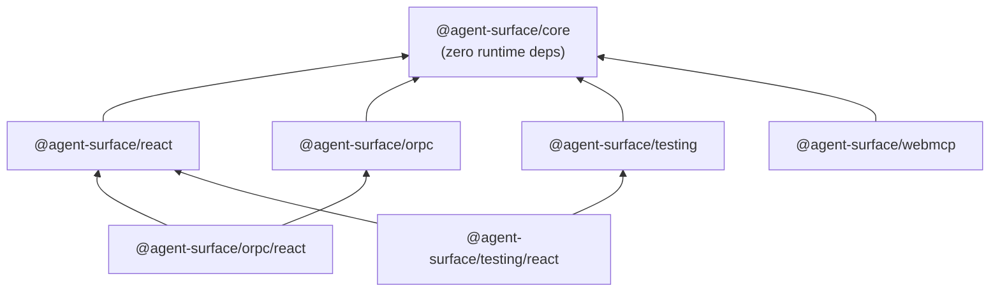
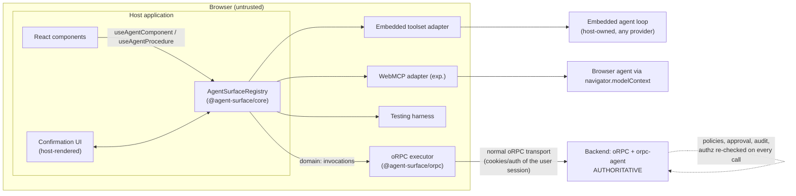
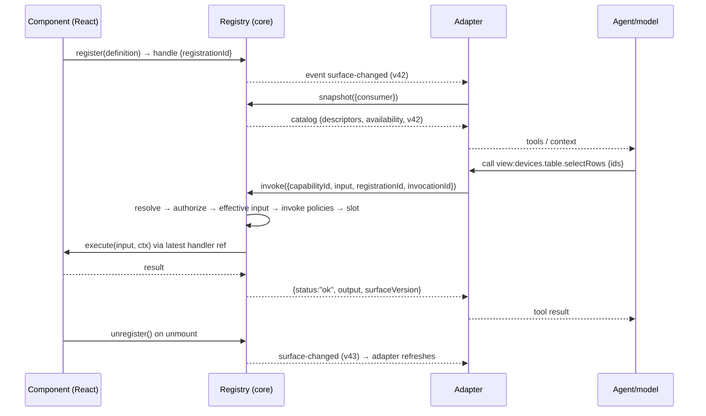

# 02 — Architecture

## Compiler-generated contract (D40)

```text
production entrypoints + lazy/virtual modules + pinned sidecars
  → @agent-surface/compiler
  → canonical manifest + embedded provenance
  → registry / exposure gateway
  → agent
```

The compiler consumes Vite's resolved production graph, not tsconfig globs. It emits `completeness: proven` or fails. The registry verifies manifest, declaration and contract hashes before accepting strict bindings. Runtime state can narrow a compiled inventory; it cannot widen it. The CLI diffs the same artifact and never mounts the application.

> [!NOTE]
> **Status: Draft** (normative where marked MUST/SHOULD). Concepts in [Concepts](01-concepts.md); APIs in [Core API](03-core-api.md)–[oRPC integration](05-orpc-integration.md).

Read this page to learn three things: **where code lives** (packages and their dependency rules), **how a call flows** (registration → discovery → the ten-phase invocation pipeline), and **what the runtime guarantees** (ordering, concurrency, memory bounds). If you're deciding whether the library fits your app, the [responsibilities table](#where-responsibilities-live) at the bottom is the fastest answer to "what would be mine to build".

## Package layout

```text
@agent-surface/core       framework-agnostic: types, ids, schema layer, registry,
                          policy pipeline, confirmation, audit, toolset, errors
@agent-surface/react      React bindings: provider + hooks (lifecycle-correct)
@agent-surface/orpc       domain procedure references + oRPC executor bridge
@agent-surface/testing    test harness, matchers, semantic snapshots (no LLM)
@agent-surface/webmcp     WebMCP transport adapter               [Experimental]
```



Dependency rules (normative):

- `core` MUST have zero runtime dependencies and MUST NOT import React, oRPC, WebMCP types, DOM APIs (beyond standard JS), or any AI-provider SDK.
- `react` depends only on `core` + `react` (peer, `>=18.2`, React 19 supported).
- `orpc` depends on `core` + oRPC client packages (peer). Its React entry point is the subpath `@agent-surface/orpc/react`.
- `testing` depends on `core`; its React entry `@agent-surface/testing/react` peers on `@testing-library/react`.
- Schema libraries (Zod, Valibot, ArkType) are integrated through the `AgentSchema` interface and Standard Schema; none is a dependency of core (D20).
- All packages are ESM-only, tree-shakeable, side-effect-free at import time (`"sideEffects": false`).

## The planes at the architecture level



Key boundary statements:

- The **registry** is the single in-page source of truth for the surface. Adapters and hooks are thin layers around it.
- **`view:` invocations** terminate inside the page (handlers registered by components).
- **`domain:` invocations** are *forwarded*, not executed: the registry applies frontend policy (availability, bindings, confirmation UX), then hands the call to the host-provided oRPC executor, which uses the user's normal authenticated transport. The server re-validates everything. The frontend is never a security boundary.
- The **agent loop / model** is always outside the library. agent-surface produces tool catalogs and executes tool calls; it never talks to an AI provider itself.

## Core internal modules

Implementers SHOULD structure `@agent-surface/core` as:

```text
src/
  ids.ts            grammar, parse/format/validate, wire-name codec
  schema.ts         AgentSchema, fromStandardSchema, fromJsonSchema,
                    JSON Schema subset validator (D19)
  definition.ts     definition types + defineAgentComponent/action/observation
                    helpers + definition validation (caps, plane rules)
  registry.ts       registrations, availability, versioning, events
  snapshot.ts       descriptor projection, filtering, budgets
  invoke.ts         invocation pipeline: dedupe/conflict → resolve → authorize →
                    effective input → invoke policies → precondition →
                    concurrency → execute → settle; tombstones
  policy.ts         policy types, composition, built-in policies
  confirmation.ts   pending-confirmation store, evidence lifecycle
  audit.ts          AuditSink, memory + console sinks
  toolset.ts        provider-neutral tool projection (embedded adapter)
  errors.ts         AgentSurfaceError, codes, payload serialization
  events.ts         event types + ordered dispatcher
```

## Runtime data flow

### Registration → discovery → invocation



### Invocation pipeline (normative order)

For every `invoke`, the registry MUST execute exactly these phases in order; the first failing phase produces the typed error shown. The order is a protocol guarantee, corrected by [Spec Corrections RFC](project/18-spec-corrections-rfc.md) (D21): **the validated effective input exists before any input-aware policy or confirmation decision runs** — a confirmation can only bind to an input that has been fully constructed and validated.

```text
 1. dedupe + conflict   key (consumerKey, invocationId): join in-flight / return
                        cached terminal; same key with a different request
                        fingerprint → INVOCATION_CONFLICT (fail closed, D22)
 2. resolve             capabilityId (+instanceId) → live registration; staleness tokens
                        └─ STALE_CAPABILITY | COMPONENT_UNMOUNTED | CAPABILITY_NOT_FOUND | AMBIGUOUS_INSTANCE
 3. availability        enabled + when() re-evaluated → CAPABILITY_NOT_AVAILABLE
 4. authorize           pre-input authority policies: onAuthorize onion + onDiscovery
                        re-check (registry → component → capability); NO agent input
                        is available to this phase, by type construction
                        └─ NOT_AUTHENTICATED | NOT_AUTHORIZED | RATE_LIMITED | CAPABILITY_NOT_FOUND (hide) | ...
 5. effective input     reject supplied locked fields → parse agent-facing input →
                        evaluate live bind() → merge per overridable-field rules →
                        validate against the FULL original schema
                        └─ INVALID_INPUT | PRECONDITION_FAILED(binding-failed)
 6. invoke policies     post-input policies: onInvoke onion over the validated
                        effective input; input-aware rate decisions; the
                        confirmation decision + evidence validation (digest over
                        effective input); audit enrichment
                        └─ CONFIRMATION_REQUIRED | CONFIRMATION_INVALID | RATE_LIMITED | ...
 7. precondition        capability precondition(effectiveInput, live state) → PRECONDITION_FAILED
 8. concurrency         action queue slot / observation admission → RATE_LIMITED(queue-full) or wait
 9. execute             handler / procedure executor, with AbortSignal + timeout
                        └─ TIMEOUT | CANCELLED | COMPONENT_UNMOUNTED (mid-flight) | EXECUTION_FAILED
10. settle              validate/serialize output, classify, update dedupe record,
                        audit, ordered events
```

Availability and policies are evaluated **at invocation time**, never trusted from discovery time (a capability may have been discovered when valid and invoked after the state changed). Phases 5–6 are the reason `PendingConfirmation.input` always shows the **bound** values the operation will actually run with — never a raw agent guess (AS-INVOKE-001…005).

## Concurrency and ordering guarantees

Normative, implementable guarantees (details and tunables in [Core API](03-core-api.md)):

1. **Single-threaded determinism.** The registry assumes a JS event loop; all state transitions are atomic within a task.
2. **Total order of surface mutations.** Every register/unregister/availability-change is assigned the next `surfaceVersion`. Observers can reconstruct the exact sequence from events.
3. **Event delivery.** Events are dispatched in mutation order, after the mutation completes. Listener exceptions are caught and reported; they never corrupt registry state or skip other listeners. Registry methods called *from* listeners are queued and run after the current dispatch completes (no re-entrant dispatch). `surface-changed` MAY coalesce multiple mutations within one microtask; the event always carries the latest version.
4. **Action serialization; bounded observation concurrency.** Actions targeting the same component instance run serially (FIFO), with a bounded wait queue. Observations run concurrently up to per-consumer and global limits with a bounded per-consumer FIFO queue; overflow is `RATE_LIMITED`, and observations never consume the action queue. (D13, amended by D24)
5. **At-most-once execution per invocation key.** The dedupe key is `(consumerKey, invocationId)` scoped to the registry (`surfaceId`). Terminal results are cached; a retry with the same key **and the same request fingerprint** returns the cached result or joins the in-flight execution; the same key with a **different** fingerprint fails closed with `INVOCATION_CONFLICT`. The window is bounded (LRU + TTL). (D14, corrected by D22)
6. **Bounded memory.** Dedupe cache, tombstones (recently unmounted registrations, used to distinguish `COMPONENT_UNMOUNTED` from `CAPABILITY_NOT_FOUND`), pending confirmations (`maxPendingConfirmations`), and observation queues are bounded LRU/TTL/cap structures with documented defaults. No runtime collection is unbounded.

## SSR, hydration, and environments

- The registry is an in-memory, per-JS-realm object. On the server (SSR/RSC) the React hooks are inert: registration happens in effects, effects don't run during server rendering, so the server-side surface is empty and no cleanup is needed. Snapshot on a server-created registry simply returns an empty surface.
- Hydration performs registrations in mount effects after hydration completes. There is no hydration mismatch risk because registration never renders anything.
- Multiple browser tabs/windows each have their own registry; cross-window surface aggregation is **Future** ([Roadmap](project/12-roadmap.md)).
- The registry accepts an `environment` (`"development" | "production" | "test"`): development enables strict validation errors, serializability probes, and loud collision diagnostics; production degrades the same conditions to safe rejections plus audit events.

## Where responsibilities live

| Concern | Library | Host application | Server |
|---|---|---|---|
| Declaring components/capabilities | primitives | authors them | — |
| Surface catalog, versioning, staleness | ✅ | — | — |
| view-action execution | dispatch + guarantees | handler logic | — |
| domain execution | forwarding + binding + UX policy | oRPC client/executor wiring | ✅ authoritative |
| AuthN/AuthZ | policy *interfaces* + context plumbing | provides auth context | ✅ authoritative |
| Confirmation | protocol, evidence, expiry, audit | renders the dialog | optional second approval |
| Rate limiting | advisory client-side policy | config | ✅ authoritative |
| Audit | events + sink interface | persistent sink | ✅ authoritative for domain |
| Agent loop / model calls | ❌ never | ✅ (or external agent) | ✅ (orpc-agent) |
| Router, data fetching, design system | ❌ never | ✅ | — |

## Bundle and performance budgets

`size-limit` enforces these in CI. The budget is the number CI fails on; the measurement is what the last release shipped.

| Entry | Measured (min+brotli) | Budget |
|---|---|---|
| `@agent-surface/core` | 18.86 kB | 19.5 kB |
| `@agent-surface/core/explain` | 1.41 kB | 2 kB |
| `@agent-surface/react` | 2.08 kB | 4 kB |

**A budget moves only in the PR whose feature moved it, and the PR says why.** Never as a side effect of unrelated work. Core's has moved three times — up for D31's meta-verb parameter descriptions, down when D28's compatibility branches were deleted, up again for D32's envelope validator; each is recorded in [Roadmap](project/12-roadmap.md) under the release that did it.

Two kinds of bytes live in that number and they are not equally expensive. **Machinery** is paid once, at download. **Model-facing description text** — currently ~430 B of `core` — is re-billed in every request carrying the tool block, so it is trimmed first and to what is load-bearing: every description names where its value comes from and nothing else.

(The original ~10 kB aspiration predates the invocation pipeline, the confirmation store, and the toolset.)

Runtime baselines from `pnpm bench` (`packages/core/bench/core.bench.ts`, Node 22, Apple-silicon dev machine, 2026-07-30). Machine-local reference points, not CI thresholds — directive §7.2 sets those once CI hardware baselines are stable.

| Operation | mean |
|---|---|
| `createAgentSurfaceRegistry()` | ~1.5 µs |
| register + unregister, 10 / 100 / 1000 components | ~0.17 ms / ~1.6 ms / ~17 ms |
| `snapshot()` at 100 components (warm descriptor cache) | ~0.16 ms |
| `buildDirectTools()` at 40 / 300 components | ~0.30 ms / ~2.1 ms |
| action invoke end-to-end, no-op handler | ~0.04 ms |
| action invoke + 2-policy authorize chain | ~0.12 ms |
| observation invoke end-to-end | ~0.02 ms |
| canonical digest (fingerprint) at ~32 kB input | ~1.9 ms |

Reading the numbers: registration stays allocation-light through a route transition (100 registrations ≈ 1.5 ms, spread across commits); pipeline overhead without handler work is tens of microseconds; the request fingerprint is O(input size) — negligible for typical tool inputs, ~2 ms at the 32 kB ceiling (it runs once per invoke, phase 1). The toolset projection is linear in mounted components (7.5× the components ≈ 6–7× the time), which is the point of the D28-era instance-detection pre-pass — the previous per-component re-filter was O(n²) on a path a remote loop runs every step.

- `snapshot()` is O(registrations) with cheap descriptor projection; descriptors are cached per registration and invalidated on version bump.
- No polling anywhere: everything is event-driven.
