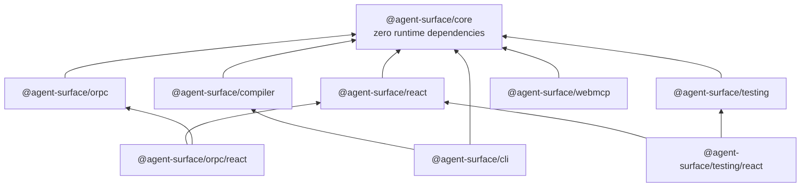
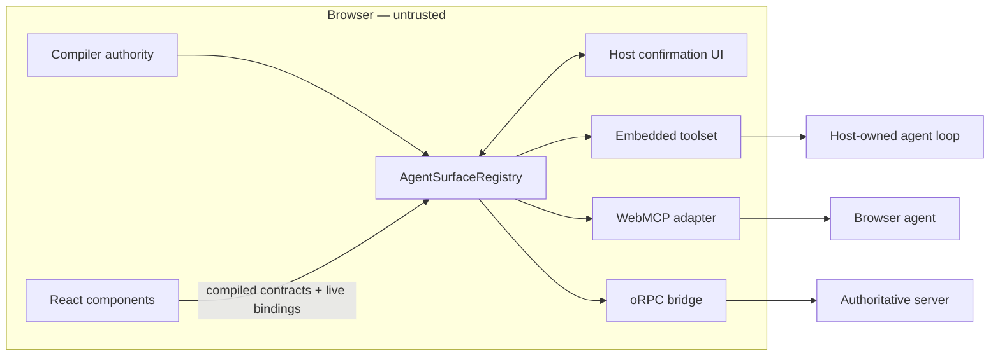
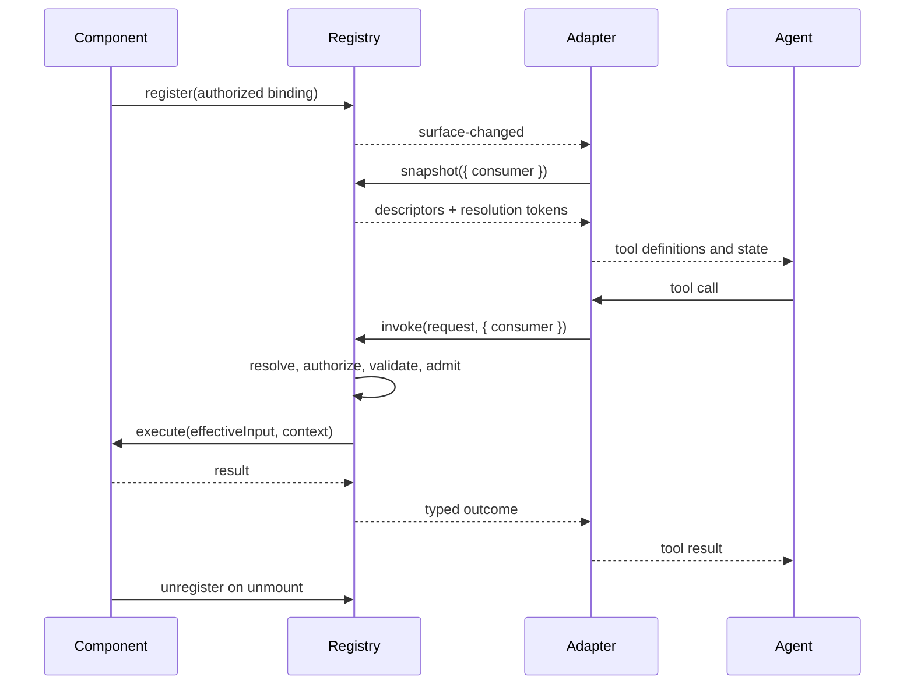

# Architecture

agent-surface has one library-owned path from source declaration to execution. The compiler manifest is the source of truth; runtime state can only narrow it.

## Compiler-generated contract

```text
production entry points + lazy/virtual modules + pinned sidecars
  → @agent-surface/compiler
  → canonical manifest
  → immutable CapabilityAuthority
```

The compiler reads Vite's resolved production graph. It emits a complete, canonical manifest or fails the build. Each declaration and capability carries stable provenance and content hashes; the complete manifest has its own hash.

The same manifest serves four consumers:

- the virtual module used by the application runtime;
- the registry's authorization checks;
- the committed review artifact;
- CLI integrity and Git-base comparisons.

The standard Vite integration has no separate authored registry or runtime inventory.

`createCapabilityAuthority(manifest)` is the public minting boundary used by the virtual module. It accepts only a complete, internally hash-consistent manifest, clones and freezes it, and records its identity privately. A direct caller may explicitly install such a manifest as its source of truth; execution is still closed over that manifest. The compiler is the production path that proves the manifest corresponds to the resolved application graph.

## Mandatory runtime authority

```text
CapabilityAuthority
  → compiled contract
  → private binding proof
  → registry semantic verification
  → registry-owned invocation
```

The authority is structural across the library's public execution boundaries:

1. `virtual:agent-surface-contract` exposes an immutable `CapabilityAuthority` minted from the compiler manifest.
2. `createAgentSurfaceRegistry` requires a genuine authority.
3. A compiled component or procedure contract can bind runtime behavior only after its declaration is found in that authority.
4. Authorization proof is stored in private `WeakMap`s, not writable object fields or exported symbols.
5. Registration verifies the declaration hash and actual runtime semantics: kind, description, schemas, effect, confirmation floor, and required policies.
6. React and oRPC accept compiled contracts plus runtime bindings.
7. Registry-backed tools and adapters execute through `registry.invoke`.
8. Standalone provider tools pass through `createAgentExposureGateway(authority)`.

### Closed capability authority

The authority defines a closed set of executable capability identities and semantics. Public APIs may bind handlers or narrow live exposure, but no public path can add a capability outside the manifest. Proof cannot be copied into a raw object, and adapters cannot replace registry-owned execution.

Missing, unknown, incomplete, stale, or semantically mismatched inputs fail closed. A registration cannot gain identity, effect, schema, confirmation posture, tags, or policy attachments from runtime data.

### Guarantee boundary

The guarantee applies to public APIs owned by agent-surface. JavaScript cannot prevent the host application from calling its own functions, constructing unrelated provider tools, or using a fake registry. Those operations are outside the library boundary.

The browser is also not authoritative for persistent or domain effects. The server must authenticate, authorize, validate, rate-limit, and audit domain operations independently.

## Closure gates

Two build-time gates prove that every published construction, execution, and exposure boundary is classified and authority-bound. The guarantee follows the generated public API and packed artifacts, so adding an export or changing package output requires the corresponding authority classification and conformance evidence.

### Public API closure

`spec/api-surface.json` classifies every symbol reachable through a published `exports` subpath. `scripts/check-api-closure.mjs` derives the inventory from each built declaration file and verifies its classification against the manifest.

| Class | Meaning |
| --- | --- |
| `authority-boundary` | Mints or verifies a `CapabilityAuthority`. |
| `capability-construction` | Produces a definition, contract or binding that could become an invocable capability. |
| `execution-boundary` | Can cause a capability handler to run. |
| `exposure-boundary` | Projects capabilities to an agent, provider or transport. |
| `introspection-only` | Read-only projection of already-authorized state. |
| `utility` / `type` | No capability semantics. |

The first four classes must also declare **how** they require an authority (`authority`, `verifies`, `mints`, `proof`, `registry`, `compiler`, `inert`) and cite at least one conformance requirement whose status is `implemented`. The gate fails on an unclassified export, a classified export that vanished, a kind mismatch, an unknown class, or a citation that is missing or not implemented.

`inert` classifies a construction API whose output cannot reach execution. `defineAgentComponent`, `action`, `observation`, and `composeInvokeChain` build values, but no published execution boundary accepts those values. `AS-CLOSURE-004` verifies that behavior.

### Published artifact closure

`scripts/check-published-artifact.mjs` runs `npm pack` for every package, inspects the resulting tarball, and asserts:

- the `exports` map is wildcard-free, and `main`/`module`/`types` point only at declared subpaths;
- the repository-only seam (`enableUnsafeAuthorityTestMode`, `disableUnsafeAuthorityTestMode`) appears in no shipped JavaScript or declaration file;
- internal symbols that do survive bundling (`isUnsafeAuthorityTestMode`) are exported from nothing.

This verifies the artifact consumers actually install.

### Closure boundary

The [guarantee boundary](#guarantee-boundary) excludes a same-realm hostile host, and the server remains authoritative for persistent effects.

## External contract authorization

A dependency can contribute capabilities to the manifest two ways, and neither is something the consumer opts into:

- **sidecar** — the package declares `agentSurface.contract` in its `package.json`, and any module of it reaching the production graph pulls the contract in;
- **source** — the package calls a contract macro in its own shipped source, which the compiler extracts directly. There is no sidecar file and nothing to address by path.

Discovery is not authorization. Both routes require an explicit approval, keyed by package name — a path is a property of the installer, a name is what a reviewer approves:

```ts
agentSurface({
  externalContracts: {
    allow: [{ package: "@vendor/plugin", digest: "6f4b…" }],
  },
})
```

The manifest then records two facts that answer different questions:

| Field | Question |
| --- | --- |
| `contractDigest` | What did the dependency contribute to *this* build? |
| `authorization.expectedDigest` | What did the consumer approve? |

They are equal whenever the build passes. Separating them is what makes the two failures distinguishable: an unapproved package is a **new** contributor, a digest mismatch is an **approved** contributor that changed. The first prints the entry to add; the second prints both digests so the change is reviewed before consent moves. Neither has an escape flag.

For the source route the digest covers the canonical set of entries extracted from that package, since there is no file to hash. Any module resolving outside `node_modules` is first-party — so a workspace package linked into a build is part of that build rather than a dependency of it.

A sidecar that no production module reaches can be named explicitly with `path`. The package name still comes from where the file lives, not from the approving entry, so a path-pinned contract cannot authorize itself under a name the consumer chose.

## Package layout

| Package | Responsibility |
|---|---|
| `@agent-surface/compiler` | Compile the production graph and virtual authority module |
| `@agent-surface/core` | Contracts, authority, registry, policy, confirmation, invocation, tool projection |
| `@agent-surface/react` | Provider and lifecycle-correct component bindings |
| `@agent-surface/orpc` | Contextual bindings to authoritative oRPC procedures |
| `@agent-surface/testing` | Deterministic harness and matchers |
| `@agent-surface/webmcp` | WebMCP transport adapter |
| `@agent-surface/cli` | Inspect, snapshot, integrity, and contract drift |



Dependency constraints:

- `core` has no runtime dependencies and does not import a framework, provider SDK, oRPC, or WebMCP type.
- `react` depends on `core` and peers on React 18.2 or newer.
- `orpc` depends on `core`; its React API is exported from `@agent-surface/orpc/react`.
- `testing` depends on `core`; React helpers are exported from `@agent-surface/testing/react`.
- schema libraries integrate through `AgentSchema` or Standard Schema and are not core dependencies.
- packages are ESM-only, tree-shakeable, and side-effect-free at import time.

## Runtime topology



- `view:` observations and actions execute in mounted frontend registrations.
- `domain:` capabilities are references to backend procedures. The registry applies frontend context and policy, then calls the host-provided executor.
- the model and provider are host concerns. agent-surface supplies tools and executes calls; it does not call a model.
- every adapter carries a stable consumer identity so policy and invocation identity remain scoped.

## Capability lifecycle



Registration freezes structural semantics for that `registrationId`. Handlers and runtime gates are read through live references. Unmounting removes executable references and invalidates stale calls.

## Invocation pipeline

Every invocation follows this order. The first failing phase returns its typed error.

```text
 1. identity         dedupe by (consumerKey, invocationId); reject conflicting reuse
 2. resolution       resolve capability, instance, registration, surface version
 3. availability     re-evaluate enabled and when()
 4. authorization    run pre-input authority policies; agent input is unavailable
 5. effective input  reject locked fields, parse input, bind live values, validate full schema
 6. invoke policy    run input-aware policy and confirmation over validated effective input
 7. precondition     evaluate the capability precondition against live state
 8. admission        enter the action queue or observation concurrency pool
 9. execution        call the handler or procedure executor with AbortSignal and timeout
10. settlement       validate output, cache terminal result, emit audit and ordered events
```

The effective input is complete and validated before any input-aware policy or confirmation decision runs. Confirmation evidence therefore binds to the same values passed to execution, including live bound fields.

Discovery is never execution authority. Availability, policy, staleness, and preconditions are checked again when the call runs.

## Concurrency and ordering guarantees

- surface mutations receive a total `surfaceVersion` order;
- events dispatch after their mutation and preserve mutation order;
- listener failures are isolated, and re-entrant operations are queued;
- actions targeting one component instance run in a bounded FIFO queue;
- observations use bounded per-consumer and global concurrency with bounded FIFO waiting;
- `(consumerKey, invocationId)` joins an identical in-flight request or returns its cached terminal result;
- reusing that identity for a different request returns `INVOCATION_CONFLICT`;
- dedupe records, tombstones, confirmation records, and queues are bounded by capacity and TTL.

See [Core API](03-core-api.md#concurrency-timeouts-cancellation) for limits and cancellation behavior.

## Environments

- The registry is in-memory and scoped to one JavaScript realm.
- React registration happens in effects, so server rendering exposes no live surface.
- Hydration registers capabilities after mount and does not affect rendered markup.
- Tabs and windows have independent registries and authorities.
- `development` enables detailed validation diagnostics. `production` safely rejects runtime collisions and records audit events.

## Responsibility boundaries

| Concern | Library | Host application | Server |
|---|---|---|---|
| Static capability contract | compile and verify | author declarations | — |
| Runtime component behavior | dispatch and lifecycle | handlers and state | — |
| Catalog, versioning, staleness | enforce | — | — |
| Domain execution | contextual forwarding | executor wiring | authoritative implementation |
| Authentication and authorization | policy interfaces | provide browser context | authoritative enforcement |
| Confirmation | evidence protocol | render and resolve UI | optional independent approval |
| Rate limiting | bounded client controls | configure | authoritative enforcement |
| Audit | events and sink interface | persist browser audit | persist domain audit |
| Model and provider calls | — | own or integrate | own or integrate |

## Performance budgets

`size-limit` enforces these package budgets:

| Entry | Measured min+brotli | Budget |
|---|---:|---:|
| `@agent-surface/core` | 21.49 kB | 22 kB |
| `@agent-surface/core/explain` | 1.42 kB | 2 kB |
| `@agent-surface/react` | 1.84 kB | 4 kB |

Representative local `pnpm bench` results:

| Operation | Mean |
|---|---:|
| create registry | ~1.5 µs |
| register and unregister 100 components | ~1.6 ms |
| snapshot 100 components with warm descriptor cache | ~0.16 ms |
| build direct tools for 300 components | ~2.1 ms |
| no-op action invocation | ~0.04 ms |
| action invocation with two authorization policies | ~0.12 ms |
| observation invocation | ~0.02 ms |
| canonical request digest at ~32 kB input | ~1.9 ms |

These are machine-local reference points, not CI thresholds. Snapshot and tool projection are linear in mounted registrations; descriptors are cached per registration and invalidated by structural change. The runtime uses events rather than polling.
