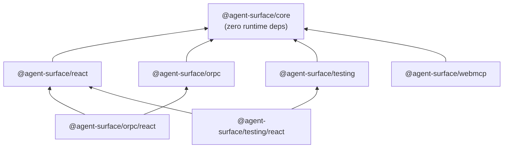
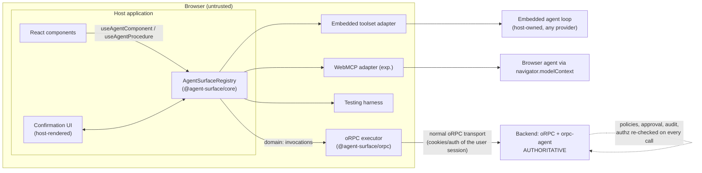

# 02 — Architecture

> [!NOTE]
> **Status: Draft** (normative where marked MUST/SHOULD). Concepts in [01-concepts.md](01-concepts.md); APIs in [03](03-core-api.md)–[05](05-orpc-integration.md).

Read this page to learn three things: **where code lives** (packages and their dependency rules), **how a call flows** (registration → discovery → the nine-phase invocation pipeline), and **what the runtime guarantees** (ordering, concurrency, memory bounds). If you're deciding whether the library fits your app, the [responsibilities table](#where-responsibilities-live) at the bottom is the fastest answer to "what would be mine to build".

## Package layout

```text
@agent-surface/core       framework-agnostic: types, ids, schema layer, registry,
                          policy pipeline, confirmation, audit, toolset, errors
@agent-surface/react      React bindings: provider + hooks (lifecycle-correct)
@agent-surface/orpc       domain procedure references + oRPC executor bridge
@agent-surface/testing    test harness, matchers, semantic snapshots (no LLM)
@agent-surface/webmcp     WebMCP transport adapter               [Experimental]
```



Dependency rules (normative):

- `core` MUST have zero runtime dependencies and MUST NOT import React, oRPC, WebMCP types, DOM APIs (beyond standard JS), or any AI-provider SDK.
- `react` depends only on `core` + `react` (peer, `>=18.2`, React 19 supported).
- `orpc` depends on `core` + oRPC client packages (peer). Its React entry point is the subpath `@agent-surface/orpc/react`.
- `testing` depends on `core`; its React entry `@agent-surface/testing/react` peers on `@testing-library/react`.
- Schema libraries (Zod, Valibot, ArkType) are integrated through the `AgentSchema` interface and Standard Schema; none is a dependency of core (D20).
- All packages are ESM-only, tree-shakeable, side-effect-free at import time (`"sideEffects": false`).

## The planes at the architecture level



Key boundary statements:

- The **registry** is the single in-page source of truth for the surface. Adapters and hooks are thin layers around it.
- **`view:` invocations** terminate inside the page (handlers registered by components).
- **`domain:` invocations** are *forwarded*, not executed: the registry applies frontend policy (availability, bindings, confirmation UX), then hands the call to the host-provided oRPC executor, which uses the user's normal authenticated transport. The server re-validates everything. The frontend is never a security boundary.
- The **agent loop / model** is always outside the library. agent-surface produces tool catalogs and executes tool calls; it never talks to an AI provider itself.

## Core internal modules

Implementers SHOULD structure `@agent-surface/core` as:

```text
src/
  ids.ts            grammar, parse/format/validate, wire-name codec
  schema.ts         AgentSchema, fromStandardSchema, fromJsonSchema,
                    JSON Schema subset validator (D19)
  definition.ts     definition types + defineAgentComponent/action/observation
                    helpers + definition validation (caps, plane rules)
  registry.ts       registrations, availability, versioning, events
  snapshot.ts       descriptor projection, filtering, budgets
  invoke.ts         invocation pipeline: resolve → policy → validate →
                    concurrency → execute → settle; dedupe cache; tombstones
  policy.ts         policy types, composition, built-in policies
  confirmation.ts   pending-confirmation store, evidence lifecycle
  audit.ts          AuditSink, memory + console sinks
  toolset.ts        provider-neutral tool projection (embedded adapter)
  errors.ts         AgentSurfaceError, codes, payload serialization
  events.ts         event types + ordered dispatcher
```

## Runtime data flow

### Registration → discovery → invocation


### Invocation pipeline (normative order)

For every `invoke`, the registry MUST execute exactly these phases in order; the first failing phase produces the typed error shown:

```text
 1. dedupe          known invocationId → return cached/in-flight result
 2. resolve         capabilityId (+instanceId) → live registration
                    └─ miss: STALE_CAPABILITY | COMPONENT_UNMOUNTED | CAPABILITY_NOT_FOUND | AMBIGUOUS_INSTANCE
 3. availability    enabled + when() re-evaluated → CAPABILITY_NOT_AVAILABLE
 4. policy chain    registry → component → capability (onInvoke, async)
                    └─ NOT_AUTHENTICATED | NOT_AUTHORIZED | RATE_LIMITED | CONFIRMATION_REQUIRED | ...
 5. input           schema parse (+ locked-binding enforcement) → INVALID_INPUT
 6. precondition    capability precondition(input) → PRECONDITION_FAILED
 7. concurrency     per-instance serial queue → RATE_LIMITED(queue-full) or wait
 8. execute         handler / procedure executor, with AbortSignal + timeout
                    └─ TIMEOUT | CANCELLED | COMPONENT_UNMOUNTED (mid-flight) | EXECUTION_FAILED
 9. settle          validate/serialize output, cache terminal result, audit, emit events
```

Availability and policies are evaluated **at invocation time**, never trusted from discovery time (a capability may have been discovered when valid and invoked after the state changed).

## Concurrency and ordering guarantees

Normative, implementable guarantees (details and tunables in [03-core-api.md](03-core-api.md)):

1. **Single-threaded determinism.** The registry assumes a JS event loop; all state transitions are atomic within a task.
2. **Total order of surface mutations.** Every register/unregister/availability-change is assigned the next `surfaceVersion`. Observers can reconstruct the exact sequence from events.
3. **Event delivery.** Events are dispatched in mutation order, after the mutation completes. Listener exceptions are caught and reported; they never corrupt registry state or skip other listeners. Registry methods called *from* listeners are queued and run after the current dispatch completes (no re-entrant dispatch). `surface-changed` MAY coalesce multiple mutations within one microtask; the event always carries the latest version.
4. **Action serialization.** Actions targeting the same component instance run serially (FIFO), with a bounded wait queue. Observations run concurrently. (D13)
5. **At-most-once execution per invocationId.** Terminal results are cached; retries with the same `invocationId` return the cached result or join the in-flight execution. (D14)
6. **Bounded memory.** Dedupe cache, tombstones (recently unmounted registrations, used to distinguish `COMPONENT_UNMOUNTED` from `CAPABILITY_NOT_FOUND`), and pending confirmations are bounded LRU/TTL structures with documented defaults.

## SSR, hydration, and environments

- The registry is an in-memory, per-JS-realm object. On the server (SSR/RSC) the React hooks are inert: registration happens in effects, effects don't run during server rendering, so the server-side surface is empty and no cleanup is needed. Snapshot on a server-created registry simply returns an empty surface.
- Hydration performs registrations in mount effects after hydration completes. There is no hydration mismatch risk because registration never renders anything.
- Multiple browser tabs/windows each have their own registry; cross-window surface aggregation is **Future** ([12-roadmap.md](12-roadmap.md)).
- The registry accepts an `environment` (`"development" | "production" | "test"`): development enables strict validation errors, serializability probes, and loud collision diagnostics; production degrades the same conditions to safe rejections plus audit events.

## Where responsibilities live

| Concern | Library | Host application | Server |
|---|---|---|---|
| Declaring components/capabilities | primitives | authors them | — |
| Surface catalog, versioning, staleness | ✅ | — | — |
| view-action execution | dispatch + guarantees | handler logic | — |
| domain execution | forwarding + binding + UX policy | oRPC client/executor wiring | ✅ authoritative |
| AuthN/AuthZ | policy *interfaces* + context plumbing | provides auth context | ✅ authoritative |
| Confirmation | protocol, evidence, expiry, audit | renders the dialog | optional second approval |
| Rate limiting | advisory client-side policy | config | ✅ authoritative |
| Audit | events + sink interface | persistent sink | ✅ authoritative for domain |
| Agent loop / model calls | ❌ never | ✅ (or external agent) | ✅ (orpc-agent) |
| Router, data fetching, design system | ❌ never | ✅ | — |

## Bundle and performance budgets (targets, not yet measured)

- `core` ≤ ~10 kB min+gzip; `react` ≤ ~4 kB; zero dependencies in core.
- `snapshot()` is O(registrations) with cheap descriptor projection; descriptors are cached per registration and invalidated on version bump.
- No polling anywhere: everything is event-driven.
- Registration/unregistration on route transitions must be allocation-light (target: no measurable frame impact at 100 registrations).
