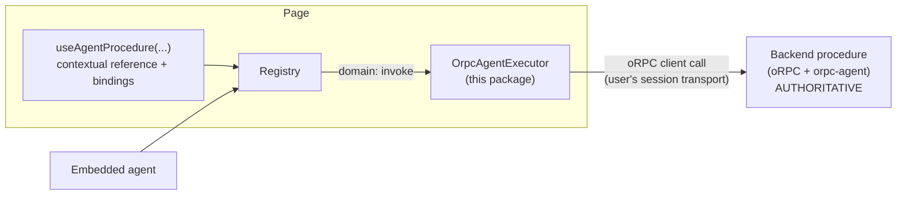

# 05 — oRPC Integration (`@agent-surface/orpc`)

> [!NOTE]
> **Status: Draft**, with the `orpc-agent` interop marked **Experimental** where noted. The interop is written against the documented API at [orpc-agent.dev](https://orpc-agent.dev) (capability registry, agent runtime, `toAISDKTools`, approvals) and is quarantined behind small interfaces so their evolution never leaks into core. Core stays oRPC-free: everything here builds on the public extension points of [03-core-api.md](03-core-api.md) (`setProcedureExecutor`, `procedures` in definitions).

If [01-concepts.md](01-concepts.md) told you *never duplicate a domain operation in the frontend*, this document is the "so what do I do instead". The short answer: you **reference** the procedure — same identity, same server authority — and the reference adds the three things only the frontend can know: whether it's relevant *right now*, which inputs come from the UI state, and what the user must confirm before it runs. For the full-stack version of this wired into a real chat (Mastra + assistant-ui), see [16-mastra-assistant-ui.md](16-mastra-assistant-ui.md).

## Purpose and non-purpose

This package lets a frontend component declare that an **existing** domain procedure is relevant *right now*, in *this view*, optionally pre-filling inputs from UI state. It exists so that:

- the agent discovers `domain:devices.disable` only when it makes contextual sense (e.g. devices are selected);
- UI-derived values (the selection) are bound authoritatively by the app, not guessed by the model;
- frontend confirmation UX can gate the call before it leaves the page.

It MUST NOT — and structurally cannot — do any of the following:

- create a second frontend tool equivalent to the procedure (identity is the procedure's canonical id; there is exactly one executor path);
- execute domain logic client-side (execution is forwarding through the host's oRPC client);
- expand domain authority (a procedure not exposed via `orpc-agent` cannot be conjured by the frontend — see [Exposure gating](#exposure-gating));
- replace server-side auth/validation/policy (the server re-evaluates everything on every call; the frontend is not a security boundary).

## Topologies



Three topologies, two of them supported:

- **Embedded agent (v0.1 target).** The loop runs in/next to the page. The toolset merges `view:` capabilities and currently-referenced `domain:` procedures into one catalog; contextual mutations flow *through the surface*, so binding, confirmation, and staleness all apply.
- **Server-side loop with per-turn frontend tools (supported).** The loop runs on a server (Mastra, AI SDK route) but a chat transport (assistant-ui, AI SDK `useChat`) re-declares the live surface's tools at the start of every turn and streams tool-calls back to the browser for execution. Contextual gating works because tools are pulled fresh per turn and availability is re-checked at invocation anyway. Non-contextual domain tools (reasoning queries) MAY additionally run server-side via orpc-agent directly — partition each operation to exactly one path. Full worked example: [16-mastra-assistant-ui.md](16-mastra-assistant-ui.md).
- **Autonomous server-side agent, no live frontend.** Propagating frontend context (bindings, contextual availability) to an agent with no page open requires a sync protocol that is deliberately **Future** (see [13-open-questions.md](13-open-questions.md#part-b--genuinely-open-questions)). v0.1 does not pretend to gate this case.

The rule the first two topologies share: an operation the user must contextually control (bound inputs, confirmation) is reachable **only** through the surface — in orpc-agent terms, `expose.aiSdk: false` on that capability, so the server-side loop cannot also see it as a direct tool.

## Identifying procedures

A procedure reference needs three things: a canonical id, agent-facing schemas, and a way to call it. All three come from a **bridge** created at app setup:

```ts
import { createOrpcAgentBridge } from "@agent-surface/orpc";

export const bridge = createOrpcAgentBridge({
  client: orpcClient,          // the app's existing typed oRPC client
  manifest: agentManifest,     // which procedures orpc-agent exposes (see below)
});

// Typed refs mirror the router path:
bridge.refs.devices.disable   // AgentProcedureRef<{deviceIds: string[]; reason?: string}, DisableResult>
```

```ts
export interface OrpcAgentBridgeOptions<TRouter> {
  client: RouterClient<TRouter>;                 // oRPC's typed client
  manifest: OrpcAgentManifest;
  /** Forward confirmation evidence / metadata into the call context. */
  callContext?: (ctx: ProcedureCallInfo) => Record<string, unknown>;
}

/**
 * [Experimental] Minimal contract this package needs from orpc-agent.
 * Derivable today from orpc-agent's own primitives — a build-time export of
 * the capability registry inventory (`capabilities.capabilities()`) or a
 * bootstrap fetch of `runtime.describe(surface, { actor, context })`, which
 * is per-user and already visibility-filtered. Hand-writing it remains the
 * escape hatch. Source choice tracked as OQ-1.
 */
export interface OrpcAgentManifest {
  tools: Record<string, {                        // key: dot path, "devices.disable"
    description: string;
    inputSchema: JsonSchema;
    outputSchema?: JsonSchema;
    effect: "server-query" | "server-mutation" | "external-side-effect" | "destructive";
    /** Server-declared flags the client must respect (e.g. approval required). */
    requiresApproval?: boolean;
  }>;
}

export interface AgentProcedureRef<TIn extends object, TOut> {
  readonly id: string;                           // "domain:devices.disable"
  readonly path: string;                         // "devices.disable"
  readonly inputSchema: JsonSchema;
  readonly outputSchema?: JsonSchema;
  readonly effect: AgentEffect;                  // from manifest
  call(input: TIn, ctx: ProcedureCallInfo): Promise<TOut>;
}
```

- The canonical id is `"domain:" + path`; the path is the orpc-agent capability path, which mirrors the router. Type inference for `TIn`/`TOut` comes from the oRPC client's router types; the manifest supplies the *agent-facing* JSON Schemas (already derived from the oRPC contracts server-side — the frontend never re-derives schemas from Zod contracts, avoiding drift between what the server enforces and what the agent sees).
- The manifest maps 1:1 from orpc-agent's capability metadata:

  | orpc-agent (`meta.agent`) | manifest field |
  |---|---|
  | capability path | key |
  | `description` | `description` |
  | contract input/output schemas | `inputSchema` / `outputSchema` |
  | `sideEffect: "read"` | `effect: "server-query"` |
  | `sideEffect: "write"` | `effect: "server-mutation"` |
  | `sideEffect: "external"` | `effect: "external-side-effect"` |
  | `sideEffect: "destructive"` | `effect: "destructive"` |
  | require-approval policy outcome | `requiresApproval` |
- `bridge.executor` is an `AgentProcedureExecutor`; installing it is one line: `registry.setProcedureExecutor(bridge.executor)`.

### Exposure gating

`createOrpcAgentBridge` only creates refs for paths present in the manifest. A `useAgentProcedure` call whose ref is not backed by the manifest (possible when the manifest is fetched at runtime and the procedure disappeared) registers **nothing**: development logs an error, production emits a `component-rejected`-style audit event. The frontend can narrow domain exposure (by simply not referencing), but can never widen it — the manifest, produced by the backend's orpc-agent configuration, is the ceiling. Even if a malicious page conjured a fake ref, the server would reject the call; gating client-side just keeps the surface honest.

## Declaring a reference

### Core-level (framework-free)

```ts
export interface AgentProcedureBindingConfig<TIn extends object, TBound extends Partial<TIn>> {
  /** Contextual availability; same semantics as capability `when`. */
  when?: () => boolean;
  unavailableReason?: string | (() => string);
  /**
   * UI-derived inputs. Evaluated at EXECUTION time (never cached from
   * discovery). Throwing or returning schema-invalid values fails the
   * invocation with PRECONDITION_FAILED (details.reason: "binding-failed").
   */
  bind?: () => TBound;
  /**
   * Bound fields the agent MAY override. Default: none — bound fields are
   * locked. See "Binding semantics" below. Use sparingly.
   */
  overridableFields?: ReadonlyArray<keyof TBound & string>;
  /** Escalate (never lower) the manifest's confirmation requirement. */
  confirmation?: "optional" | "required";
  /** Extra frontend policies (client-side, advisory). */
  policies?: AgentPolicy[];
  /** Contextual description appended to the manifest description. */
  describe?: () => string;
  meta?: Record<string, JsonValue>;
}

export function bindAgentProcedure<TIn extends object, TOut, TBound extends Partial<TIn>>(
  ref: AgentProcedureRef<TIn, TOut>,
  config?: AgentProcedureBindingConfig<TIn, TBound>,
): AgentProcedureBinding<TIn, TOut>;
```

The returned `AgentProcedureBinding` goes into `AgentComponentDefinition.procedures` (or is registered standalone by the React hook below).

### React (`@agent-surface/orpc/react`)

```tsx
export function useAgentProcedure<TIn extends object, TOut, TBound extends Partial<TIn>>(
  ref: AgentProcedureRef<TIn, TOut>,
  config?: AgentProcedureBindingConfig<TIn, TBound>,
): void;
```

```tsx
function DevicesTable() {
  const [selectedIds, setSelectedIds] = useState<string[]>([]);
  useAgentComponent({ type: "devices.table", … });

  useAgentProcedure(bridge.refs.devices.disable, {
    when: () => selectedIds.length > 0,
    unavailableReason: "Select at least one device first",
    bind: () => ({ deviceIds: selectedIds }),
    confirmation: "required",
    describe: () => `Currently bound to the ${selectedIds.length} selected device(s)`,
  });
}
```

Lifecycle mirrors `useAgentComponent`: registers in an effect, unregisters on unmount, `bind`/`when`/`describe` read through the latest-ref (fresh at execution), availability pushed on change. If the hook runs inside a mounted `useAgentComponent`'s render scope for the same component function, the reference records that component as its `context`; otherwise `context` is absent (page-level reference). Both are valid.

## Binding semantics (D7, D8 — Draft)

Let `B` = keys produced by `bind()` (statically: `keyof TBound`).

1. **Agent-facing input schema** = manifest input schema minus locked keys of `B`: removed from `properties` and `required`. All-bound ⇒ `{type:"object", properties:{}, additionalProperties:false}` and the agent calls with `{}`. This is how partially-bound inputs are *represented*: the agent never sees fields it must not supply.
2. **Locked by default (D8).** Agent-supplied values for locked fields ⇒ `INVALID_INPUT` with `details.lockedFields`. Rationale: a bound value is an authoritative statement of the app's UI state ("the selection *is* these ids"); letting the model override it silently reintroduces guessing. Locking is enforced *before* merge, so a locked field cannot be smuggled past validation.
3. **`overridableFields`** flips specific fields to defaults: the field stays in the agent-facing schema (annotated `default` = "current UI value at execution"); an agent-supplied value wins, otherwise `bind()`'s value applies. Discouraged; remember the server authorizes whatever ids arrive regardless.
4. **Evaluation time.** `bind()` runs during invocation phase 5 (input), on the live UI state — never a cached discovery-time value. Discovery-time snapshots include binding *metadata*, not binding *values* (values may be sensitive and would go stale).
5. **Effective input** = `parse(manifestSchema, merge(agentInput restricted to unlocked, bind()))` — the merged object is validated against the **full original schema** before forwarding, so a binding bug cannot ship an invalid call.
6. **Static typing.** `TBound extends Partial<TIn>` makes wrong-typed bindings a compile error; `overridableFields` is constrained to `keyof TBound`. Top-level fields only in v0.1; deep-path binding is an open question (OQ-6).

## Snapshot descriptor

```ts
export interface AgentProcedureDescriptor {
  procedureId: string;                    // "domain:devices.disable"
  description: string;                    // manifest description + contextual describe()
  /** Agent-facing (reduced) input schema per binding rule 1. */
  inputSchema: JsonSchema;
  outputSchema?: JsonSchema;
  effect: "server-query" | "server-mutation" | "external-side-effect" | "destructive";
  confirmation: "never" | "optional" | "required";   // max(manifest, reference)
  available: boolean;
  unavailableReason?: string;
  boundFields: Array<{ path: string; locked: boolean; source: "ui-state" }>;
  /** The registration that contributed this reference (staleness token). */
  registrationId: string;
  /** Optional link to the owning view component. */
  context?: { type: string; instanceId: string };
  meta?: Record<string, JsonValue>;
}
```

Procedure descriptors live at the **top level** of the snapshot (`snapshot.procedures`), never nested inside components: the planes stay structurally distinct, and a procedure referenced by two components appears as two entries disambiguated by `registrationId`.

### Multiple simultaneous references

Two mounted components may reference the same procedure with different bindings (two tables, each binding its own selection). Invocation then MUST carry the `registrationId` of the intended reference; omitting it with >1 live reference ⇒ `AMBIGUOUS_INSTANCE` (`details.instances` lists them with their `context`). With exactly one, it MAY be omitted.

## Execution flow

`invoke({capabilityId: "domain:devices.disable", …})` runs the standard pipeline ([02](02-architecture.md#invocation-pipeline-normative-order)) with these specifics:

1. Resolution targets the procedure *reference* registration (staleness applies to the reference: a reference from a dead snapshot ⇒ `STALE_CAPABILITY`).
2. Frontend policies run: reference policies, then confirmation. `destructive`/`external-side-effect` + `surfaceVersion` mismatch ⇒ `STALE_CAPABILITY` ([03 §versioning](03-core-api.md#versioning)).
3. Input phase applies binding semantics above.
4. The registry calls the installed executor:

```ts
export interface AgentProcedureExecutor {
  execute(req: {
    path: string;
    input: JsonValue;                          // effective, validated input
    info: ProcedureCallInfo;
  }): Promise<JsonValue>;
}

export interface ProcedureCallInfo {
  invocationId: string;
  consumer: AgentConsumer;
  signal: AbortSignal;
  confirmation?: { id: string; approvedAt: string };
}
```

5. The bridge's executor calls the oRPC client with the user's normal authenticated transport, passing `callContext(info)` if configured — this is where apps forward confirmation evidence or an `x-agent-invocation-id` header if their backend wants them. Transport/procedure errors are sanitized into `EXECUTION_FAILED` (safe message; full error to logs/audit only — see [07-errors.md](07-errors.md)). An oRPC `UNAUTHORIZED`-class error maps to `NOT_AUTHORIZED` where distinguishable.
6. The server re-evaluates authentication, authorization, tenant, validation, rate, and its own approval policy (orpc-agent). A server-side approval requirement can surface as a structured error the executor maps to `CONFIRMATION_REQUIRED` (`details.origin: "server"`) — the frontend confirmation and the server approval are **independent layers**; passing the first never satisfies the second.

## What the client checks vs what the server must re-check (D10)

| Check | Client (this package) | Server (oRPC + orpc-agent) |
|---|---|---|
| Procedure exposed to agents | manifest gate (honesty) | ✅ authoritative |
| AuthN / AuthZ / tenant | advisory policies (UX: hide/disable) | ✅ MUST re-check |
| Input validity | full-schema parse before forwarding | ✅ MUST re-validate |
| UI bindings (selection etc.) | ✅ only place that can know them | trusts values only as *input*, authorizes them like any input |
| Contextual availability (`when`) | ✅ (view concept; server can't know) | n/a |
| Confirmation UX | ✅ evidence protocol | MAY require its own approval |
| Rate limits | advisory | ✅ authoritative |
| Audit | frontend events | ✅ authoritative record |

## Anti-duplication rules (recap, normative)

- A procedure reference's identity IS the procedure id. There is no "frontend variant" id, ever.
- Registering a `view:` capability whose `type.name` equals a manifest path triggers the suffix-collision diagnostic ([03 §collisions](03-core-api.md#collisions-d4)).
- `confirmation` and policies on a reference can only **tighten**, never loosen, what the manifest declares (`requiresApproval`, `destructive` floor from [01 defaults](01-concepts.md#orthogonal-properties-and-defaults)).
- If you find yourself writing an `execute` handler in this package, you are duplicating the domain — there is deliberately no place to put one.
