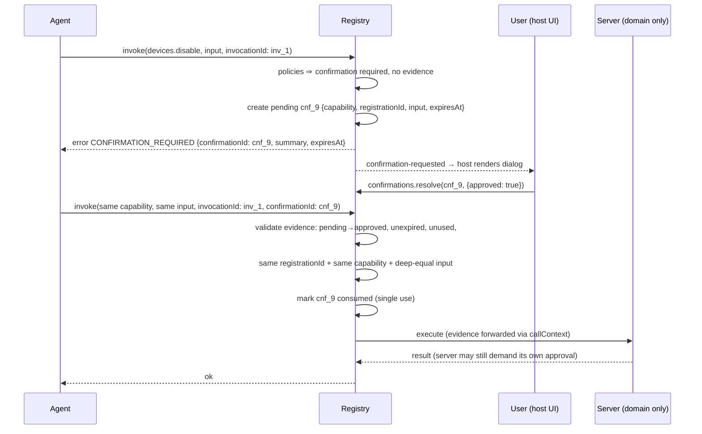

# 06 — Policies and Security

> [!NOTE]
> **Status: Draft** (normative). The security stance in one sentence: *the frontend is never a security boundary; agent-surface makes the client honest, minimal, and auditable, and leaves authority to the server.*

The model in one paragraph: nothing is exposed unless registered; what is exposed is filtered per consumer by **policies** at discovery and re-checked at invocation; anything dangerous demands **single-use confirmation evidence** bound to the exact inputs the user saw; every step emits **audit events**; and for domain operations all of that is UX layered *on top of* server enforcement, never instead of it. If you review one thing before shipping, make it the [threat model table](#threat-model) and the [hide-vs-disable rule](#hide-vs-disable-d11d12-restated-as-the-policy-authors-rule).

## Threat model

Actors and failure modes this design defends against, and how:

| Threat | Vector | Mitigation |
|---|---|---|
| Prompt-injected agent invokes something harmful | malicious content steers the model | deny-by-default surface; effect taxonomy; confirmation evidence for dangerous effects; runtime (not model) authority; server re-validation |
| Agent acts on a vanished/changed UI | route change between discovery and invoke | registrationId staleness, tombstones, `COMPONENT_UNMOUNTED`/`STALE_CAPABILITY` |
| Confirmation replay / bait-and-switch | approve A, execute B; reuse old approval | evidence bound to exact (registration, capability, input), single-use, TTL |
| Overexposure of state | observations dumping stores | minimal-output norm, output caps, per-capability policies, audit `full` |
| Less-trusted page code registers capabilities | third-party widget/plugin | `origin` labels + registration guard |
| Client tampering (DevTools, compromised bundle) | anything client-side | **out of scope by design** — nothing client-side is load-bearing for domain authority; the server re-checks everything |
| Duplicate/confusable tools | `view:devices.disable` shadowing domain op | plane rule, suffix-collision diagnostics, single executor path |

What the library explicitly does NOT claim: isolation between scripts in the same realm (a malicious script can call the registry like any other code — the registry's guarantees bound *honest* code and keep the *agent* honest; they cannot contain hostile same-realm JS), and any client-side protection of domain operations beyond UX.

## The deny-by-default requirements, mapped

The twelve minimum requirements and where each is enforced:

1. **No automatic UI scanning** — there is no scanning code path; the only entry is `register()`. (Architecture invariant.)
2. **No implicit capabilities** — nothing is exposed without an explicit definition; empty registry ⇒ empty surface.
3. **Stable capability identity** — canonical grammar, code-authored ids ([01 §identity](01-concepts.md#the-identity-ladder)).
4. **Identity independent of text/position/CSS** — grammar forbids it; React docs forbid index-derived instanceIds; nothing in core touches the DOM.
5. **Descriptions confer no authority** — descriptions are annotations; the pipeline never branches on them.
6. **Authority = registration + policies + authenticated context** — invocation pipeline phases 2–6 ([02](02-architecture.md#invocation-pipeline-normative-order)).
7. **Server always re-validates** — executor forwards through the user's session; [05 §D10 table](05-orpc-integration.md#what-the-client-checks-vs-what-the-server-must-re-check-d10).
8. **Stale invocations rejected** — `STALE_CAPABILITY`/`COMPONENT_UNMOUNTED` ([03 §versioning](03-core-api.md#versioning)).
9. **First-party vs untrusted registrants distinguishable** — `origin` + `onRegister` guard (below).
10. **Audit events for register/remove/invoke** — event stream + `AuditSink` (below).
11. **Observation minimization + authorization** — policies apply to observations; output caps; hide-vs-disable rule; authoring norms ([04 anti-patterns](04-react-api.md#anti-patterns-normative-should-nots)).
12. **No invoking outside the granted surface** — invocation re-runs the same per-consumer policy chain that filtered the snapshot; a capability hidden from consumer C at discovery is equally denied to C at invocation (`CAPABILITY_NOT_FOUND`, indistinguishable from nonexistence).

## Policy pipeline

### Types

```ts
export type DiscoveryDecision =
  | { decision: "expose" }
  | { decision: "disable"; reason: string }     // visible-disabled
  | { decision: "hide" };                       // absent from snapshot

export type AgentPolicyContext = {
  capabilityId: string;
  plane: "view" | "domain";
  kind: "observation" | "action" | "procedure";
  effect: AgentEffect;
  registrationId: string;
  consumer: AgentConsumer;
  host: Readonly<Record<string, unknown>>;      // RegistryOptions.context()
  meta: { component?: Record<string, JsonValue>; capability?: Record<string, JsonValue> };
  internal: Readonly<Record<string, unknown>>;  // never serialized
};

export interface AgentPolicy {
  name: string;
  /**
   * Discovery-time filter. MUST be synchronous, cheap, side-effect free
   * (snapshot() is sync). Advisory: hides/disables in catalogs.
   * Default when absent: expose.
   */
  onDiscovery?(ctx: AgentPolicyContext): DiscoveryDecision;
  /**
   * Invocation-time gate (pipeline phase 4). MAY be async. Runs in onion
   * order; call next() to proceed. Throw AgentSurfaceError (or return an
   * error outcome) to deny. This — not onDiscovery — is the client-side gate.
   */
  onInvoke?(
    ctx: AgentPolicyContext & { invocationId: string; input?: JsonValue },
    next: () => Promise<AgentInvocationResult>,
  ): Promise<AgentInvocationResult>;
}
```

### Composition and evaluation (normative)

- Attachment points: registry (`RegistryOptions.policies`) → component (`definition.policies`) → capability (`def.policies`). Chains concatenate in that order; `onInvoke` wraps onion-style (registry outermost), `onDiscovery` runs in order with **most-restrictive-wins**: any `hide` ⇒ hidden; else any `disable` ⇒ disabled (first reason kept); else exposed.
- **Re-evaluation at invocation is mandatory.** Discovery decisions are never cached into invocation: a capability discovered when valid and invoked after state changed hits the full chain again (plus `onDiscovery` re-run in phase 4 preamble — a policy that now says `hide` yields `CAPABILITY_NOT_FOUND`, `disable` yields `CAPABILITY_NOT_AVAILABLE`).
- The sync/async split is deliberate: discovery filtering must be computable from already-loaded client state (auth store, feature flags); anything requiring I/O is not a discovery concern — enforce it in `onInvoke` or (authoritatively) on the server.
- Policies MUST NOT mutate input. Input transformation is not a policy concern in v0.1 (no rewriting middleware; keeps the audit trail truthful).

### Hide vs disable (D11/D12, restated as the policy author's rule)

> **Authority hides. State discloses.**

- `hide` when the consumer/user lacks the *right* (authz, tenant, plan, feature flag): existence is information you don't owe them.
- `disable` with a reason when the *state* makes it momentarily invalid (nothing selected, already open): the reason teaches the agent what to do first.

## Built-in policies

All Draft; all implementable in core without external deps. Host semantics (what "authenticated" means) are injected, not assumed.

```ts
/** Requires ctx.host.user (configurable key). Fails NOT_AUTHENTICATED; hides at discovery. */
export function authenticated(opts?: { key?: string }): AgentPolicy;

/** Delegates to a host authorizer over ctx.host. Fails NOT_AUTHORIZED; hides at discovery. */
export function hasPermission(
  permission: string,
  check: (host: Record<string, unknown>, permission: string) => boolean,
): AgentPolicy;

/** Tenant boundary: hides unless selector(host) === expected(ctx). */
export function tenantBoundary(opts: {
  current: (host: Record<string, unknown>) => string | undefined;
  expected: (ctx: AgentPolicyContext) => string | undefined;   // e.g. from internal meta
}): AgentPolicy;

/** Restricts to environments. Others: hidden. */
export function environment(allowed: AgentEnvironment[]): AgentPolicy;

/** Token bucket per (consumer, capability). Advisory. Fails RATE_LIMITED {retryAfterMs}. */
export function rateLimit(opts: { limit: number; windowMs: number }): AgentPolicy;

/** Escalates confirmation to "required" (optionally conditionally). */
export function requireConfirmation(opts?: {
  if?: (ctx: AgentPolicyContext & { input?: JsonValue }) => boolean;
  summary?: (input: JsonValue) => string;
}): AgentPolicy;

/** Forwards invocation events to a sink at the given detail level. */
export function audit(sink?: AuditSink, level?: "metadata" | "full"): AgentPolicy;
```

The builder-style attachment from the design sketch is supported as sugar over definitions and MAY be used in non-React setups:

```ts
registry.register(
  defineAgentComponent({
    type: "devices.table",
    description: "…",
    policies: [authenticated(), hasPermission("devices:read", check), audit()],
    actions: { selectRows: action({ … }) },
  }),
);
```

Concepts required by the spec and where they land: authentication (`authenticated`), authorization (`hasPermission`), tenant boundary (`tenantBoundary`), component visibility (`enabled` + [04 §visibility](04-react-api.md#visibility)), state validity (`when`/`precondition`), stale detection ([03 §versioning](03-core-api.md#versioning)), rate limiting (`rateLimit`), execution environment (`environment`), mandatory confirmation (`requireConfirmation` / `confirmation: "required"`), audit (`audit` + sinks), reversibility (declared property feeding confirmation defaults), conditional availability (`when` + `onDiscovery`).

## Confirmation

### Protocol



### Normative rules

1. **Representation.** `CONFIRMATION_REQUIRED` is a typed error result (`retry: "with-confirmation"`) carrying `details: { confirmationId, summary, expiresAt, effect }`. It is a protocol step, not a failure.
2. **Correlation.** The pending record stores `capabilityId`, `registrationId`, `consumerId`, and the exact effective input (post-binding, post-parse). The retry MUST match all of them — input by deep equality — else `CONFIRMATION_INVALID` (`details.reason: "mismatch"`). This kills bait-and-switch: the user approves *these ids*, not "whatever the next call says".
3. **Single use.** Evidence is consumed atomically by the first successful validating retry; a second use ⇒ `CONFIRMATION_INVALID` (`reason: "consumed"`).
4. **Expiry.** Default TTL 120 s (`limits.confirmationTtlMs`); expiry emits `confirmation-resolved {outcome:"expired"}`; late retry ⇒ `CONFIRMATION_INVALID` (`reason: "expired"`). Retry while still pending (user hasn't decided) ⇒ `CONFIRMATION_REQUIRED` again with the *same* `confirmationId` (no new dialog spam).
5. **Denial.** User denial ⇒ retry fails `CONFIRMATION_INVALID` (`reason: "denied"`, `retry: "no"`). Adapters MUST NOT auto-retry a denial.
6. **Staleness beats confirmation.** If the owning registration died while pending, the retry fails `COMPONENT_UNMOUNTED`/`STALE_CAPABILITY` regardless of approval — an approval cannot resurrect a dead context.
7. **Server revalidation.** For domain procedures, evidence is forwarded (via `callContext`) as *information*; the server MUST NOT treat it as authorization. orpc-agent-level approvals are an independent layer; the executor maps a server approval demand to `CONFIRMATION_REQUIRED` with `details.origin: "server"`.
8. **Audit.** Requested/approved/denied/expired/consumed each produce an audit event with actor (`user` for resolutions), timestamps, and capability identity; `audit: "full"` capabilities include the input payload.
9. **UX modes.** The two-phase flow above is canonical (transport-friendly, auditable). The embedded toolset's `confirmations: "wait"` mode is sugar: it performs the wait-and-retry internally so the model sees one call → one result ([03 §toolset](03-core-api.md#toolset)). Semantics and audit are identical.

Extension interfaces (kept deliberately small in v0.1): custom `summary` composition, a host hook to *veto* confirmations programmatically (`confirmations.resolve(..., {approved:false, reason})` from any host logic), and per-capability TTL. A full enterprise approval workflow (roles, queues, escalation) is a non-goal ([11](11-non-goals.md)); the seam for it is the server side.

## Trust model for registrants

```ts
export interface RegistrationCandidate {
  definition: AgentComponentDefinition;   // includes origin (default "first-party")
  stack?: string;                          // dev-mode capture for diagnostics
}
```

- `origin` is a claim by calling code, useful for *honest* segmentation (plugin SDKs tagging themselves); the guard (`RegistryOptions.onRegister`) can reject origins, cap their effects (e.g. reject any non-first-party `procedures`), or namespace them.
- Limits of the mechanism (stated honestly): same-realm JS can lie about `origin`. Real containment of untrusted code requires an out-of-realm boundary (iframe/worker + postMessage adapter), which is Future work. v0.1's guard is a policy tool, not a sandbox.

## Audit

```ts
export interface AuditEvent {
  at: string;                              // ISO-8601
  type:
    | "registration" | "unregistration" | "registration-rejected"
    | "invocation-started" | "invocation-settled"
    | "confirmation-requested" | "confirmation-approved"
    | "confirmation-denied" | "confirmation-expired" | "confirmation-consumed"
    | "late-settlement" | "collision-suspected";
  capabilityId?: string;
  registrationId?: string;
  invocationId?: string;
  consumerId?: string;
  status?: "ok" | "error";
  code?: AgentCapabilityErrorCode;
  durationMs?: number;
  /** Present only for capabilities with audit: "full"; size-capped. */
  payload?: { input?: JsonValue; output?: JsonValue };
  /** Redaction hook applied before payload storage. */
}

export interface AuditSink {
  record(event: AuditEvent): void;         // MUST NOT throw; MUST be non-blocking
}

export function memoryAuditSink(opts?: { capacity?: number }): AuditSink & { events(): AuditEvent[] };
export function consoleAuditSink(): AuditSink;
```

Levels per capability: `"none"` (no events beyond registration), `"metadata"` (identity, timing, status — default), `"full"` (adds payloads through an optional `redact` transform). Persistence, shipping to a backend, retention: host concerns — the sink interface is the seam.

## Data minimization checklist (authoring norms)

- Observations return projections, not stores; include ids + the fields an agent needs to *decide*, not to *render*.
- `meta` is for stable semantic hints, never for secrets, tokens, or PII; `internal` exists precisely so policies can use sensitive context without serializing it (and its non-serialization is a tested invariant).
- Error messages sent to agents are written for agents: state what failed and what to do next, never stack traces, queries, or internal identifiers ([07-errors.md](07-errors.md#execution_failed)).
- Descriptions describe; they do not promise ("can delete anything" in a description grants nothing but misleads the model — write what the capability actually does).
