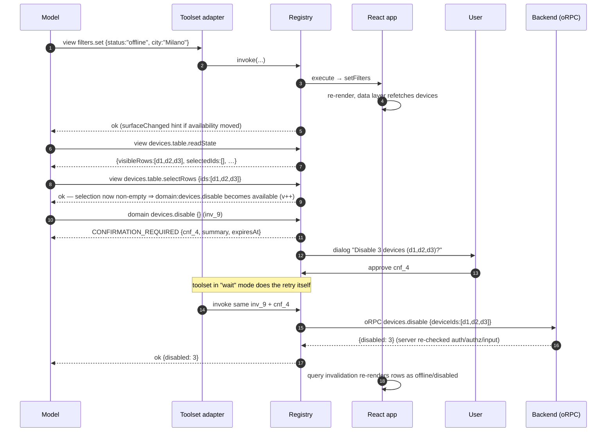

# 10 — Examples: the Devices Page, End to End

> [!NOTE]
> **Status: illustrative but normative for behavior** — every payload and transition shown here follows [03](03-core-api.md)–[07](07-errors.md), and the test suite in [08](08-testing.md) asserts them. Code marked *host app* is application code, not library code.

This walkthrough is deliberately transport-agnostic: the "agent" here could be any consumer behind any adapter. To see the same page wired into a real full-stack chat — Mastra running the loop, assistant-ui rendering it, orpc-agent governing the domain — read [16-mastra-assistant-ui.md](16-mastra-assistant-ui.md) after this one.

The page: status/city filters, a devices table with multi-select and sorting, a detail drawer, a "Disable" flow backed by the existing oRPC procedure `devices.disable` (exposed via `orpc-agent`).

Target surface while the page is mounted:

```text
view:devices.filters.read        observation
view:devices.filters.set         action (local-state)
view:devices.table.readState     observation
view:devices.table.selectRows    action (local-state)
view:devices.table.sort          action (local-state)
view:devices.drawer.open         action (local-state)
view:devices.drawer.close        action (local-state)
domain:devices.disable           procedure ref — available iff selection non-empty
```

## Setup (host app)

```ts
// src/agent/registry.ts
import { createAgentSurfaceRegistry, authenticated } from "@agent-surface/core";
import { createOrpcAgentBridge } from "@agent-surface/orpc";
import { orpcClient } from "../api/client";
import { agentManifest } from "../api/agent-manifest"; // produced from orpc-agent config
import { router } from "../router";
import { authStore } from "../auth";

export const registry = createAgentSurfaceRegistry({
  environment: import.meta.env.DEV ? "development" : "production",
  context: () => ({ user: authStore.user, tenantId: authStore.tenantId }),
  policies: [authenticated()],
  route: () => ({ path: router.state.location.pathname }),
});

export const bridge = createOrpcAgentBridge({ client: orpcClient, manifest: agentManifest });
registry.setProcedureExecutor(bridge.executor);
```

```tsx
// src/main.tsx
<AgentSurfaceProvider registry={registry}>
  <App />
  <AgentConfirmationHost />   {/* renders pending confirmations, see 04 */}
</AgentSurfaceProvider>
```

## Schemas (host app)

```ts
import { z } from "zod";
import { fromStandardSchema } from "@agent-surface/core";

const zs = <T extends z.ZodType>(s: T) =>
  fromStandardSchema(s, { jsonSchema: z.toJSONSchema(s) });

export const FiltersState = z.object({
  status: z.enum(["all", "online", "offline"]),
  city: z.string().nullable().describe("Exact city name filter, null = all cities"),
});
export const FiltersPatch = FiltersState.partial()
  .describe("Fields omitted are left unchanged");

export const TableState = z.object({
  visibleRows: z.array(z.object({
    id: z.string(), name: z.string(),
    status: z.enum(["online", "offline"]), city: z.string(),
  })).describe("Rows currently rendered under the active filters"),
  selectedIds: z.array(z.string()),
  sorting: z.object({ by: z.enum(["name", "status", "city"]), dir: z.enum(["asc", "desc"]) }),
});

export const SelectRows = z.object({
  ids: z.array(z.string()).min(1),
  mode: z.enum(["replace", "add", "remove"]).default("replace"),
});
export const Sort = TableState.shape.sorting;
export const OpenDrawer = z.object({ deviceId: z.string() });

export const FiltersStateSchema = zs(FiltersState);
export const FiltersPatchSchema = zs(FiltersPatch);
export const TableStateSchema  = zs(TableState);
export const SelectRowsSchema  = zs(SelectRows);
export const SortSchema        = zs(Sort);
export const OpenDrawerSchema  = zs(OpenDrawer);
```

## Filters component (host app)

One agent component for the whole filter bar — granularity follows intent, not widget count.

```tsx
function DeviceFilters({ filters, onChange }: Props) {
  useAgentComponent({
    type: "devices.filters",
    description: "Status and city filters applied to the devices table",
    observations: {
      read: observation({
        description: "Currently active filters",
        output: FiltersStateSchema,
        read: () => filters,
      }),
    },
    actions: {
      set: action({
        description: "Update one or both filters; omitted fields are unchanged. " +
          "The table refreshes through the app's normal data fetching.",
        input: FiltersPatchSchema,
        effect: "local-state",
        idempotent: true,
        execute: (patch) => onChange({ ...filters, ...patch }),
      }),
    },
  });
  return <FilterBar … />;
}
```

## Table + procedure reference (host app)

```tsx
function DevicesTable() {
  const [selectedIds, setSelectedIds] = useState<string[]>([]);
  const [sorting, setSorting] = useState<Sorting>({ by: "name", dir: "asc" });
  const devices = useDevicesQuery();     // refetches when filters change — normal app code

  useAgentComponent({
    type: "devices.table",
    description: "Table of devices matching the active filters",
    observations: {
      readState: observation({
        description: "Visible rows, current selection, current sorting",
        output: TableStateSchema,
        read: () => ({ visibleRows: devices.rows.map(toRow), selectedIds, sorting }),
      }),
    },
    actions: {
      selectRows: action({
        description: "Replace, extend or reduce the row selection",
        input: SelectRowsSchema,
        effect: "local-state",
        precondition: ({ ids }) => {
          const unknown = ids.filter((id) => !devices.byId.has(id));
          if (unknown.length)
            return { message: "Some ids are not in the current result set", details: { unknown } };
        },
        execute: ({ ids, mode }) => setSelectedIds(apply(selectedIds, ids, mode)),
      }),
      sort: action({
        description: "Change the table sorting",
        input: SortSchema, effect: "local-state", idempotent: true,
        execute: setSorting,
      }),
    },
  });

  useAgentProcedure(bridge.refs.devices.disable, {
    when: () => selectedIds.length > 0,
    unavailableReason: "Select at least one device first",
    bind: () => ({ deviceIds: selectedIds }),
    confirmation: "required",
    describe: () => `Currently bound to the ${selectedIds.length} selected device(s)`,
  });

  return <Table … />;
}
```

The drawer follows the same pattern (`devices.drawer` with `open`/`close` actions and an `isOpen`/`deviceId` observation) — elided for brevity; full version in the example app.

## The scenario

> **User to the embedded copilot:** "Show me the offline devices in Milan, select the visible ones and disable them."



### Step by step, with payloads and ownership

| # | Step | Wire reality | Owned by |
|---|---|---|---|
| 1 | `view:devices.filters.set` | `invoke {capabilityId, input:{status:"offline",city:"Milano"}, registrationId, invocationId}` → `{status:"ok"}` | library dispatch; handler = app |
| 2 | UI updates, data refetch | React state → app's query layer refetches | **app entirely** (reactive consequence, [01 litmus](01-concepts.md#the-litmus-test)) |
| 3 | `view:devices.table.readState` | → `{status:"ok", output:{visibleRows:[…3 rows], selectedIds:[], sorting}}` | library; read = app |
| 4 | `view:devices.table.selectRows` `{ids:[d1,d2,d3]}` | precondition validates ids → ok; `when` flips ⇒ availability push, `surface-changed` v++ | library + app handler |
| 5 | Contextual discovery of `domain:devices.disable` | next catalog shows the procedure `available:true`, `inputSchema:{}` (all bound), `boundFields:[{path:"deviceIds",locked:true}]` | library |
| 6 | Execution request | `invoke {capabilityId:"domain:devices.disable", input:{}, invocationId:"inv_9", registrationId, surfaceVersion}` | library |
| 7 | `CONFIRMATION_REQUIRED` | error payload `{code, retry:"with-confirmation", details:{confirmationId:"cnf_4", summary:"Disable 3 devices…", expiresAt}}` | library |
| 8 | User confirms | `AgentConfirmationHost` dialog → `confirmations.resolve("cnf_4",{approved:true})` — evidence bound to (reg, capability, input `{deviceIds:[d1,d2,d3]}`), single-use | dialog = app; evidence = library |
| 9 | Authoritative execution | retry inv_9+cnf_4 → binding re-evaluated → full-schema parse → executor → oRPC call under user session → **server re-validates everything** | library forwards; **server authoritative** |
| 10 | UI update | app invalidates its devices query; agent MAY `readState` to verify | app |
| 11 | Audit | events: registrations, availability change, inv_9 started/settled, cnf_4 requested/approved/consumed | library events; persistence = app sink |

Failure branches worth knowing (all tested in [08 recipes](08-testing.md#recipes-normative-test-list)): user denies → `CONFIRMATION_INVALID {reason:"denied"}`, no retry; selection changes between approval and retry → `mismatch`; user navigates away mid-flow → `COMPONENT_UNMOUNTED`; model tries `input:{deviceIds:["victim"]}` → `INVALID_INPUT {lockedFields:["deviceIds"]}`.

## Smaller patterns

**Navigation as a capability** (the router stays the app's):

```tsx
function AgentNavigation() {
  const navigate = useNavigate();
  useAgentComponent({
    type: "app.navigation",
    description: "Top-level navigation between application pages",
    observations: {
      current: observation({
        description: "Current route", output: RouteSchema,
        read: () => ({ path: location.pathname }),
      }),
    },
    actions: {
      goTo: action({
        description: "Navigate to a known application page",
        input: zs(z.object({ page: z.enum(["devices", "reports", "settings"]) })),
        effect: "navigation",
        execute: ({ page }) => navigate(pageRoutes[page]),
      }),
    },
  });
  return null;
}
```

Enum-of-known-pages beats free-form paths: typed, tab-completable for the model, and no open-redirect-shaped surface.

**Two instances of one type:**

```tsx
<DevicesTable instance="main" … />
<DevicesTable instance="comparison" … />
// inside: useAgentComponent({ type: "devices.table", instanceId: props.instance, … })
```

The agent sees both in the catalog and must target `instanceId` (else `AMBIGUOUS_INSTANCE`).

**Map focus** — same shape as any action: `map.focusDevice` with `input:{deviceId}`, `effect:"local-state"`, precondition "device is on the map".

## The page's test file (host app, excerpt)

```tsx
import { renderAgentSurface } from "@agent-surface/testing/react";

it("exposes the documented surface", async () => {
  const s = await renderAgentSurface(<DevicesPage />, { wrapper: AppProviders });
  for (const id of [
    "view:devices.filters.read", "view:devices.filters.set",
    "view:devices.table.readState", "view:devices.table.selectRows",
    "view:devices.table.sort",
  ]) expect(s).toExpose(id);
  expect(s).toExposeUnavailable("domain:devices.disable",
    { reason: "Select at least one device first" });
  expect(s).toMatchSurfaceSnapshot();
});

it("runs the full disable flow", async () => {
  const s = await renderAgentSurface(<DevicesPage />, { wrapper: AppProviders });
  await s.invoke("view:devices.filters.set", { status: "offline", city: "Milano" });
  const state = await s.observe<TableState>("view:devices.table.readState");
  await s.invoke("view:devices.table.selectRows", { ids: state.visibleRows.map(r => r.id) });

  let r = await s.invoke("domain:devices.disable", {});
  expect(r).toFailWith("CONFIRMATION_REQUIRED");
  s.confirmations.approve();
  r = await s.invoke("domain:devices.disable", {},
    { confirmationId: r.error.details!.confirmationId as string });
  expect(r).toBeOk();
  expect(mockExecutor.calls[0].input).toEqual({ deviceIds: state.visibleRows.map(r => r.id) });
});
```

No LLM anywhere; the "agent" in tests is the test.
