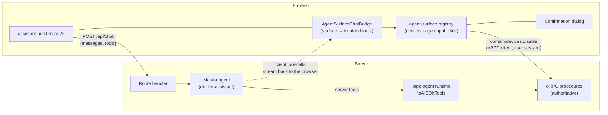

# 16 — Integration Guide: Mastra + assistant-ui + orpc-agent

> [!WARNING]
> **Status: wiring guide — NOT an executable example.** Every snippet on this page is hand-written prose-adjacent code: none of it exists in `examples/`, none is compiled, none is covered by a test. There is no Mastra server, no `AgentSurfaceChatBridge.tsx`, no orpc-agent runtime in this repository. Treat the code as a *shape to follow*, not a file to copy-run.
>
> The repository's one executable example is [10-examples.md](10-examples.md) → `examples/devices-app` (runnable, 13 tests, the scripted end-to-end scenario, requirement `AS-EXAMPLE-001`). That app *does* use assistant-ui for its chat thread, with a local scripted loop — the server-side half described here (Mastra loop, per-turn frontend-tool transport, orpc-agent governance) is unbuilt.
>
> Consequence to respect: because these snippets are not type-checked, they can drift silently when `@agent-surface/*` APIs change (they already needed a manual patch when D26 made toolset topology explicit). Directive [§9.3](17-maintainer-directive.md) asks for executable examples; promoting this page into a real package is tracked as future work in [15-completeness-review.md](15-completeness-review.md).

> [!NOTE]
> **Third-party APIs.** The `@agent-surface/*` code follows this spec (design phase, not yet published); the `orpc-agent`, Mastra, and assistant-ui APIs are quoted from their current documentation ([orpc-agent.dev](https://orpc-agent.dev), as of mid-2026) and may drift. Where a third-party API is load-bearing, the text says which one and why.

**The question this page answers:** *does agent-surface work with an agent framework like Mastra?*

**Yes — by design, and without a dedicated package.** agent-surface never talks to a model itself; it produces a provider-neutral tool catalog (name, description, JSON Schema, execute) via [`createAgentToolset`](03-core-api.md#toolset). Any stack that accepts JSON-Schema tools can consume it: Vercel AI SDK, Mastra, LangGraph, assistant-ui's model context, a hand-rolled loop. What follows is the full wiring for one concrete, popular stack:

- **Mastra** runs the agent loop server-side;
- **assistant-ui** renders the chat and transports frontend tools per turn;
- **orpc-agent** governs the domain procedures the model may call server-side;
- **agent-surface** exposes the page's presentation capabilities — and the *contextual* domain references — from the browser.

## What you'll build

The devices page from [10-examples.md](10-examples.md), plus a chat panel. The user types *"show the offline devices in Milan, select them and disable them"*; the model coordinates presentation tools (filters, selection — executed in the browser) and domain tools (listing for its own reasoning — executed on the server; disabling — executed through the surface with binding and confirmation).



### Who executes what

This is the load-bearing decision of the whole page. Each tool the model sees lives on exactly one side:

| Tool the model sees | Kind | Declared by | Executed | Why there |
|---|---|---|---|---|
| `domain_devices__list` | domain query | orpc-agent (`expose.aiSdk: true`) | **server**, inside Mastra | reasoning data; no UI context needed; works even with no page open |
| `view_devices__filters__set` … | presentation | agent-surface toolset, forwarded per turn | **browser** | exists only while the page is mounted; touches React state |
| `view_devices__table__readState` … | presentation | agent-surface toolset | **browser** | reads live view state |
| `domain_devices__disable` | domain mutation, **contextual** | agent-surface procedure reference | **browser → oRPC client → server** | needs the selection binding + user confirmation; the server stays authoritative |

> [!IMPORTANT]
> `devices.disable` is deliberately **not** exposed to the model server-side (`expose.aiSdk: false` below). If it were, the model would see two disable tools — the duplication that [05 §anti-duplication](05-orpc-integration.md#anti-duplication-rules-recap-normative) forbids and the suffix-collision guard warns about. One operation, one path: the contextual one, with the selection bound and the human in the loop. The server governs it either way.

## 1 · Backend: capabilities with orpc-agent

orpc-agent shares this spec's philosophy — deny-by-default exposure, one procedure per operation, policies and audit attached — so the backend half is idiomatic orpc-agent code, nothing agent-surface-specific:

```ts
// server/agent/capabilities.ts
import { os } from "@orpc/server";
import { agentProcedure, createCapabilityRegistry, createAgentRuntime } from "@orpc-agent/core";
import { z } from "zod";

const base = os.$context<AppContext>();
const agentBase = agentProcedure(base);          // adds meta.agent + ctx.agent typing

export const listDevices = agentBase
  .meta({
    agent: {
      description: "List devices, optionally filtered by status and city. Read-only.",
      expose: { aiSdk: true, direct: true, test: true },   // reachable by the model loop
      sideEffect: "read",
      risk: "low",
    },
  })
  .input(z.object({
    status: z.enum(["online", "offline"]).optional(),
    city: z.string().optional(),
  }))
  .handler(({ input, context, signal }) => context.devices.list(input, { signal }));

export const disableDevices = agentBase
  .meta({
    agent: {
      description: "Disable the given devices. Destructive: they stop reporting data.",
      expose: { aiSdk: false, direct: true, test: true },  // NOT a server-side model tool —
      sideEffect: "destructive",                           // reached only contextually, via the
      risk: "high",                                        // frontend surface (see table above)
    },
  })
  .errors({ DEVICE_NOT_FOUND: { message: "One or more devices do not exist." } })
  .input(z.object({ deviceIds: z.array(z.string()).min(1), reason: z.string().optional() }))
  .handler(({ input, context }) =>
    context.devices.disable(input.deviceIds, { by: context.user.id }));

export const capabilities = createCapabilityRegistry({
  devices: { list: listDevices, disable: disableDevices },
});

export const agentRuntime = createAgentRuntime({
  registry: capabilities,
  policies: [requirePermission("devices:read")],   // your orpc-agent policies
  audit: [auditSink],
});
```

The browser reaches `devices.disable` through the app's normal authenticated oRPC client — the same path a "Disable" button would use — so the procedure's own middleware (authn, authz, tenant) applies unchanged. Model-initiated *server-side* calls go through `agentRuntime` and get orpc-agent's governance on top.

## 2 · Server: the Mastra agent and the chat route

The agent itself is plain Mastra. The interesting line is the instructions: the tool descriptions already carry `[view · …]` / `[domain · …]` prefixes (the toolset adds them, [09](09-adapters.md#embedded-toolset-adapter-draft)), and telling the model what the prefixes mean measurably improves its planning:

```ts
// src/mastra/agents/device-assistant.ts
import { Agent } from "@mastra/core/agent";
import { anthropic } from "@ai-sdk/anthropic";

export const deviceAssistant = new Agent({
  name: "device-assistant",
  instructions: `You help the user operate their devices dashboard.
Tools prefixed [view] change or read what the user currently sees — prefer them
for anything about the open page. Tools prefixed [domain] act on real
application data. Before a [domain] mutation, read the relevant view state and
tell the user what you are about to do. If a tool result says an action is
unavailable, do the enabling step it suggests instead of retrying.`,
  model: anthropic("claude-sonnet-5"),
});
```

The route handler is where the three libraries meet. assistant-ui's default transport sends `{ messages, system, tools }`, where `tools` are the frontend tool *schemas* (execution stays in the browser). Server tools are built **per request** from orpc-agent, bound to the authenticated caller — never cached across users:

```ts
// app/api/chat/route.ts
import { mastra } from "@/src/mastra";
import { frontendTools } from "@assistant-ui/react-ai-sdk";
import { toAISDKTools } from "@orpc-agent/ai-sdk";
import { toAISdkStream } from "@mastra/ai-sdk";
import { createUIMessageStream, createUIMessageStreamResponse } from "ai";
import { agentRuntime } from "@/server/agent/capabilities";

export async function POST(req: Request) {
  const session = await requireSession(req);
  const { messages, tools } = await req.json();

  // Domain tools — server-executed, governed by orpc-agent, per-request identity.
  const domainTools = await toAISDKTools(agentRuntime, {
    actor: { id: session.userId, kind: "user" },
    context: await createAppContext(session),
  });

  const agent = mastra.getAgent("device-assistant");
  const stream = await agent.stream(messages, {
    toolsets: { domain: domainTools },          // executed here, inside the loop
    clientTools: frontendTools(tools ?? {}),    // declared to the model; tool-calls
  });                                           // stream back to the browser to run

  const uiStream = createUIMessageStream({
    originalMessages: messages,
    execute: async ({ writer }) => {
      for await (const part of toAISdkStream(stream, { from: "agent" })) writer.write(part);
    },
  });
  return createUIMessageStreamResponse({ stream: uiStream });
}
```

(assistant-ui also forwards `system` — client-contributed instructions from `getModelContext`; merge it into the agent's instructions if you use that feature.)

## 3 · Browser: the bridge — 30 lines that make Mastra "support" agent-surface

This is the only genuinely new code in the whole example. It projects the live agent surface into assistant-ui's model context as frontend tools. Because assistant-ui *pulls* `getModelContext()` at the start of every run, each turn sees the current surface — mount a drawer and its capabilities join the next turn; navigate away and they're gone. No subscription plumbing needed:

```tsx
// src/chat/AgentSurfaceChatBridge.tsx
import { tool, useAui } from "@assistant-ui/react";
import { createAgentToolset } from "@agent-surface/core";
import { useAgentSurface } from "@agent-surface/react";
import { useEffect } from "react";

export function AgentSurfaceChatBridge() {
  const aui = useAui();
  const registry = useAgentSurface();

  useEffect(() => {
    const toolset = createAgentToolset(registry, {
      consumer: { id: "device-chat", kind: "embedded" },
      topology: "remote",       // server-side loop, per-turn frontend tools (D26)
      confirmations: "wait",    // explicit opt-in: dialog resolves before the
    });                         // tool result returns — see the note below
    const unregister = aui.modelContext().register({
      getModelContext: () => ({
        tools: Object.fromEntries(
          toolset.tools().map((t) => [
            t.name,
            tool({
              type: "frontend",
              description: t.description,
              parameters: t.inputSchema,        // JSON Schema, straight through
              execute: async (args, { toolCallId }) => {
                const result = await t.execute(args, { toolCallId });
                return result.status === "ok"
                  ? (result.output ?? { done: true })
                  : result.error;               // typed payload: code, retry, details
              },
            }),
          ]),
        ),
      }),
    });
    return () => { unregister(); toolset.dispose(); };
  }, [aui, registry]);

  return null;
}
```

Three details worth noticing:

- **`toolCallId` becomes the `invocationId`**, scoped to this bridge's consumer, so a retried stream never double-executes an action — and an id accidentally reused for a *different* request fails closed with `INVOCATION_CONFLICT` ([03 §identity](03-core-api.md#invocation-identity-idempotency-conflict-safety-d14-as-corrected-by-d22)).
- **Errors are returned, not thrown.** A `CAPABILITY_NOT_AVAILABLE` payload with its `reason` goes back to the model as tool output — that reason ("Select at least one device first") is exactly what the model needs to self-correct.
- **This is a `remote` topology** (the loop streams from a server), so its default confirmation mode is `two-phase` (D26, [09 §confirmation-topology](09-adapters.md#confirmation-topology)). The example opts into `"wait"` explicitly for the simplest chat UX — one call, one final result — which holds the streaming run open across the dialog: acceptable only when your transport timeout comfortably exceeds the confirmation TTL. Drop the `confirmations` line to get the safer two-phase default, where the model receives `CONFIRMATION_REQUIRED` and retries next turn.

The page itself composes pieces you have already seen:

```tsx
// src/pages/DevicesPage.tsx — capabilities exactly as in 10-examples.md
"use client";
import { AssistantRuntimeProvider } from "@assistant-ui/react";
import { useChatRuntime } from "@assistant-ui/react-ai-sdk";
import { Thread } from "@/components/assistant-ui/thread";   // your assistant-ui setup

export function DevicesWorkspace() {
  const runtime = useChatRuntime({ api: "/api/chat" });
  return (
    <div className="grid grid-cols-[1fr_380px]">
      <DevicesPage />                {/* registers view capabilities + the        */}
                                     {/* contextual domain:devices.disable ref    */}
      <AssistantRuntimeProvider runtime={runtime}>
        <AgentSurfaceChatBridge />
        <Thread />
      </AssistantRuntimeProvider>
      <AgentConfirmationHost />      {/* renders pending confirmations (04)       */}
    </div>
  );
}
```

## 4 · One conversation, end to end

> **User:** disable the offline devices in Milan

1. **Turn starts.** assistant-ui pulls `getModelContext()` → the current surface (filters, table, drawer — `domain:devices.disable` is listed but *unavailable: "Select at least one device first"*) is forwarded as `tools`; the route adds `domain_devices__list` from orpc-agent.
2. Model calls `view_devices__filters__set {status:"offline", city:"Milano"}` → streamed to the browser → bridge → registry → React state updates, the app refetches. Result: `ok`.
3. Model calls `view_devices__table__readState` → sees three visible rows.
4. Model calls `view_devices__table__selectRows {ids:[…]}` → selection set; the `when` on the procedure reference flips, so the *next* turn's catalog will show `domain_devices__disable` as available. (Within this same turn the tool already exists in the catalog; only its availability changed — and availability is re-checked at invocation, not trusted from the catalog.)
5. Model calls `domain_devices__disable {}` (input empty: `deviceIds` is bound and locked). The registry evaluates the binding against the *live* selection, hits `confirmation: "required"` → the dialog renders: *"Disable 3 devices (d1, d2, d3)?"*.
6. User confirms. The evidence is single-use and bound to those exact ids ([06 §confirmation](06-policies-and-security.md#confirmation)); the toolset retries internally, the oRPC client executes under the user's session, the server re-validates everything, rows go grey.
7. The tool result (`ok`, with the current `surfaceVersion`) returns through the stream; the model summarizes what happened.

Had the model tried `domain_devices__disable {deviceIds:["victim"]}`, the locked-binding rule would have answered `INVALID_INPUT { lockedFields: ["deviceIds"] }` — the model cannot aim the operation anywhere the user isn't looking.

## Where orpc-agent's approvals fit

This example gates the destructive call with agent-surface's **frontend confirmation** — appropriate here because the human is present and the call runs under their session. orpc-agent has its own, stricter layer: policy-driven, input-hash-bound, single-use **approvals** on the server (`{ status: "approval-required", approvalId, … }` as a tool result; `runtime.approvals.decide` + `runtime.resume` to continue). The two are independent by design — [06 rule 7](06-policies-and-security.md#normative-rules): the server MUST NOT treat a frontend confirmation as authorization. Use both when the operation warrants it (the chat then shows the approval-required message and your approver UI drives `decide`); for a simple in-session app like this one, frontend confirmation plus the server's normal authorization is a reasonable floor.

## What this example deliberately leaves out

Memory/threads (Mastra has them; orthogonal), streaming tool UI (`assistant-ui` tool render components — plug them into the same `tool()` definitions), multi-page routing (add the `app.navigation` component from [10 §patterns](10-examples.md#smaller-patterns)), and orpc-agent MCP exposure (a different surface of the same capabilities). None of it changes the bridge.

## Takeaways

- **"Is Mastra supported?" is the wrong shape of question** — nothing here is Mastra-specific except ~10 lines in the route. The same bridge serves plain AI SDK `streamText` (drop the Mastra middle), LangGraph, or an in-page loop. The adapter contract ([09](09-adapters.md)) is the support.
- **The tool partition is the architecture.** Server-reasoning tools via orpc-agent; view tools and *contextual* domain references via the surface; each operation reachable by exactly one path.
- **Per-turn pull makes lifecycle free.** Because both assistant-ui (`getModelContext`) and this spec (snapshot-per-turn, availability re-checked at invocation) are pull-based, mounting and unmounting components just works — no tool-list synchronization code exists anywhere in this example.
